# SDD Pipeline — Architecture & Skill Reference

How the 60 skill files in `skills/` wire together: what each one does, what it calls, what it reads/writes, and when it runs. Read this after `README.md` (the pitch) and `skills/orchestrator/SKILL.md` (the source of truth) — this doc exists to make the *shape* of the system visible at a glance.

## 1. The Big Picture

SDD Pipeline is not a program — it's a tree of Markdown "skill" files an AI coding agent reads and follows, plus 3 zero-dependency `.mjs` scripts that mechanically check what prose can't guarantee. One file, `skills/orchestrator/SKILL.md`, is the entry point; everything else is either a **phase skill** it dispatches to, a **mode** that dials behavior up/down, a **constraint pack**, or **meta machinery** that runs across every phase.

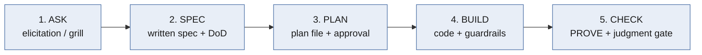

This sequence is **fixed** — same order every time. Only *depth* adapts, driven by four things the orchestrator detects on every task:

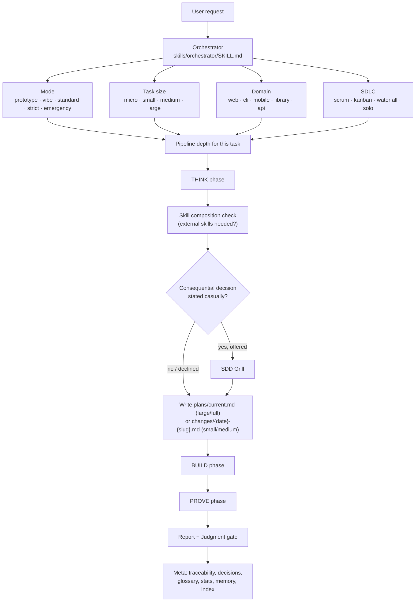

**Evidence gates scale with size** — this is the contract that keeps the pipeline honest (never silently skipping, never silently adding ceremony):

| Gate | micro | small | medium | large / full |
|---|---|---|---|---|
| DoD | — | ✅ always | ✅ | ✅ |
| Test plan file | — | named in DoD | ✅ | ✅ |
| Threat model | — | zone-triggered | zone-triggered | ✅ mandatory |
| Coverage gate ≥80% | — | run tests, no % gate | ✅ | ✅ |
| Traceability matrix | — | — | lite inline `Refs:` | ✅ full matrix + ship gate |

`strict` promotes every gate one size-level down; `prototype`/`vibe` demote; `emergency` defers to a post-fix follow-up. See §8 for the full mode dial.

---

## 2. Orchestrator (`skills/orchestrator/SKILL.md`)

The only skill registered as a top-level entry point (alongside the 5 commands in §11). It never does the work itself — it detects context, dispatches to phase skills, and owns the plan-approval flow and the meta bookkeeping at the end.

| | |
|---|---|
| **Detects** | mode, task size, domain, SDLC, architecture (delegates each detection to a THINK skill) |
| **Owns** | the fixed ASK→SPEC→PLAN→BUILD→CHECK sequence, plan-file writing (`docs/sdd/plans/current.md`) and its approval flow, the stats footer, session persistence (stays active all session once triggered) |
| **Dispatches to** | every skill under `think/`, `build/`, `prove/`, `meta/`; loads the matching file from `modes/[mode]/SKILL.md` and `constraints/[domain]/SKILL.md` |
| **Multi-agent rule** | THINK skills spawn in parallel and merge; BUILD splits by independent file/component; PROVE spawns one agent per layer — see §10 |

---

## 3. THINK phase — `skills/think/`

Everything that has to happen *before* code, so the agent isn't guessing scope, architecture, or security posture mid-build.

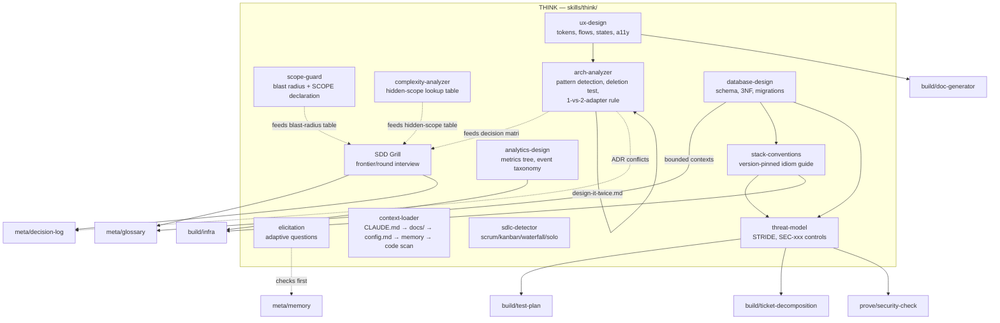

| Skill | What it does | Calls / feeds | Writes to |
|---|---|---|---|
| **elicitation** | Asks 0–5 adaptive questions scaled to task size (micro=0 … large=3-5); checks memory first so a settled answer is never re-asked; "I don't know" → builds simplest version, lists assumptions | reads `docs/sdd/memory/INDEX.md` | nothing (inline) |
| **context-loader** | Loads project context in priority order: `CLAUDE.md`/`AGENTS.md` → `docs/` → `config.md` → `memory/INDEX.md` → code scan fallback; brownfield vs greenfield distinction; scopes to the relevant package in a monorepo | — | nothing (inline summary) |
| **scope-guard** | Blast-radius table by task type (bug fix 1-5 files, migration 20+…) with hard limits; requires a `SCOPE: IN/OUT/files expected` declaration before coding; pauses if exceeded (standard/strict) | recommendation source for **grill** and **arch-analyzer** | nothing (inline + completion notes) |
| **complexity-analyzer** | Lookup table mapping surface prompts ("add search") to hidden sub-scope (indexing, ranking, pagination…); escalates task size when hidden complexity found | recommendation source for **grill** | nothing (inline) |
| **sdlc-detector** | Detects Scrum/Kanban/Waterfall/Solo from `config.md` → project signals (`.jira/`, `.linear/`, `ROADMAP.md`…) → ask-once fallback; outputs an adaptation block consumed by scope-guard, elicitation, change-plan, report, decision-log | reads project signals, `docs/sdd/config.md` | a note in `docs/sdd/memory/` if it had to ask |
| **arch-analyzer** | Detects 1 of 16 architecture patterns via directory/import/config signals + confidence scoring; Deletion Test + "1 adapter=hypothetical, 2=real" heuristics; consistency report for brownfield, decision matrix + proposed tree for greenfield; optional self-contained HTML visual report (temp dir only); "Design It Twice" multi-agent technique for high-stakes calls | `design-it-twice.md` (companion), `build/anti-patterns` (premature-abstraction xref), `docs/sdd/decisions/` (ADR-conflict check), `agents/orchestration` (spawn gate), hands off to **grill** | no fixed doc path (inline / temp-dir HTML) |
| **threat-model** | STRIDE pass over the FSD/SDS's data-flow diagram at trust boundaries; rates Likelihood×Impact; writes SEC-xxx controls (Mitigate/Accept/Transfer/Avoid); OWASP-ish baseline always checked | `build/test-plan` (TEST-xxx per High/Critical control), `build/ticket-decomposition` (ticket per control), `prove/security-check` (PROVE-side pair via shared SEC-xxx), `prove/judgment`, `meta/traceability` | `docs/sdd/design/{NNN}-{slug}-threats.md` |
| **database-design** | One-entity-one-responsibility schema modeling from the domain glossary; 3NF default; naming/FK/cascade/index rules; additive-first migrations | `build/doc-generator/formats.md` (ERD shape), `docs/sdd/glossary.md`, `think/stack-conventions`, `think/threat-model` (multi-tenant isolation) | `docs/sdd/erd/{NNN}-{slug}-erd.md` |
| **ux-design** | Confirms direction with a concrete preview first (respects existing design system if present); design tokens (WCAG AA) as SSOT; **one `design.md` entry doc always, however many files the content splits into** (mechanically enforced); index-first flow files; 4 states (empty/loading/error/success) per screen; yields to an external UI/UX skill on aesthetics if installed | `think/arch-analyzer` (process peer), `build/doc-generator`, `check-file-hygiene.mjs` | `docs/sdd/design-system/design.md` + `docs/sdd/design/{NNN}-{slug}-ux.md` + one file per flow at `docs/sdd/ux-screens/<flow-slug>.md` |
| **stack-conventions** | Reads official docs (context7/MCP/research skill) for the chosen stack+version, turns them into version-pinned, checkable rules; scaffolds config-as-code (`tsconfig.json`, ESLint, etc.) | `build/infra` (CI wiring), `think/threat-model` (security defaults), `constraints/` (stays stack-neutral layer beneath this) | `docs/sdd/stack-guide.md` + scaffolded config files |
| **analytics-design** | Turns PRD success criteria into a metrics tree (north-star/inputs/guardrails), event taxonomy, funnels/cohorts, instrumentation plan; enforces no-PII-without-consent | `build/infra` (observability), `think/threat-model` (privacy) | `docs/sdd/analytics.md` |
| **grill** (SDD Grill) | Interviews the user round-by-round over a "design tree," asking the whole open **frontier** per round with a recommendation per question; adversarial toward the user's premises *and* its own recommendations; **council pass** (5 seats: devil's advocate, maintainer-1yr-later, security, cost, end-user) for decisions passing rule-of-three; never runs uninvited | `think/arch-analyzer`, `think/scope-guard`, `think/complexity-analyzer`, `constraints/[domain]`, `build/constraints`, `think/sdlc-detector`, `meta/glossary`, `meta/decision-log`, `agents/orchestration` | live updates to `docs/sdd/glossary.md`; ADRs via `meta/decision-log`; feeds (never writes) `docs/sdd/plans/current.md` |

---

## 4. BUILD phase — `skills/build/`

Runs once a plan is approved. This is where code gets written, tracked, and shaped to fit within declared scope.

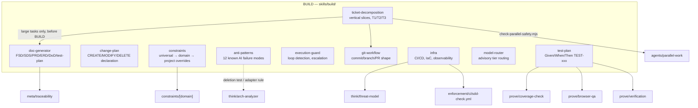

| Skill | What it does | Calls / feeds | Writes to |
|---|---|---|---|
| **constraints** | Loads universal (10 rules: YAGNI, dep limits, no premature abstraction…) → domain-specific → project overrides, in that order; secrets rule (#7) is non-negotiable | `constraints/[domain]/SKILL.md`, `docs/sdd/config.md`, `CLAUDE.md`/`AGENTS.md`, decision log on override | decision-log entry + memory on override |
| **change-plan** | Requires a `CHANGE PLAN:` block (CREATE/MODIFY/DELETE + why) before code; tracks deviations live; produces a Planned-vs-Deviations-vs-Refactoring summary after | `docs/sdd/plans/current.md` | contributes to plan file / verification report |
| **doc-generator** | Auto-decides which docs a task needs (feature→FSD+DoD, DB change→ERD+SDS+DoD…); DoD floor for small+; numbered per-feature files (never append-forever); owns the ID spine (`FSD-003`, `SEC-004`, `TICKET-012`…); splits `docs/user/` vs `docs/dev/` | `formats.md` (companion templates), `meta/traceability`, `meta/decision-log`, `meta/glossary` | `docs/sdd/design/`, `erd/`, `dod/`, `test-plans/`, `index.md`, `docs/user/`, `docs/dev/` |
| **anti-patterns** | Scans generated code against 12 patterns (God Function, Deep Nesting, Hallucinated API, Hardcoded Secrets, N+1 Queries, Over-Typing…) and self-corrects | `think/arch-analyzer` (deletion test / adapter rule for over-engineering pattern) | corrects code in place; notes change in standard/strict |
| **execution-guard** | Detects repeated-failure loops (same approach/error 2+ times) → escalates with 3 options instead of spinning; periodic progress signals; rapid-iteration detection (3+ prompts/2min → lightweight mode) | — | inline status only |
| **git-workflow** | Commit granularity (1 per ticket), message format (`type(scope): what — why — Refs: TICKET-xxx, FSD-xxx`), branch naming, honest PR descriptions (never claims an ungated pass) | relies on ID spine from `doc-generator`/`meta/traceability`; composes with external branch-finishing skills | commit messages, branch names, PR body |
| **infra** | Turns deployment ADRs into CI (coverage gate, dep scanning, SAST, e2e, docs-drift check, traceability + file-hygiene checks), IaC, secrets/config management, observability tied to REQ-NF SLOs; hard-stops before any real provisioning/deploy | `think/threat-model` (baseline), `enforcement/ci/sdd-check.yml`, `prove/coverage-check`, `prove/browser-qa`, `check-traceability.mjs`, `check-file-hygiene.mjs` | CI config, IaC defs, observability config |
| **model-router** | Advisory-only: routes sub-tasks to CHEAP/MID/STRONG model tiers by a fixed table (lint→CHEAP, architecture→STRONG…); ignored entirely in single-model environments | reads `check: mechanical`/`check: judgment` tags from `build/constraints` | nothing |
| **test-plan** | Converts acceptance criteria into TEST-xxx cases across 5 classes (happy/regression/edge/e2e/non-functional); enforces LOCAL-only test env as a hard stop; coverage target default ≥80% | `formats.md`, `docs/sdd/traceability.md`, `prove/browser-qa`, `think/threat-model`, `prove/coverage-check`, `prove/verification` | `docs/sdd/test-plans/{NNN}-{slug}-tests.md` |
| **ticket-decomposition** | Splits `large` tasks into vertical slices (never layer-splits) with computed blocking edges; expand→migrate→contract exception for wide mechanical refactors; T1/T2/T3 tiers; optional GitHub Issues mirror (asked, never assumed); Kanban ticket-status flow | `docs/sdd/traceability.md` (global TICKET-xxx), `check-parallel-safety.mjs`, `build/git-workflow` | `docs/sdd/tickets/{feature-slug}/{NN}-{ticket-slug}.md` |

---

## 5. PROVE phase — `skills/prove/`

Runs after BUILD. Proves the code runs (verification/coverage/security/performance/adversarial), then the judgment gate proves a *human* actually understands and accepts it.

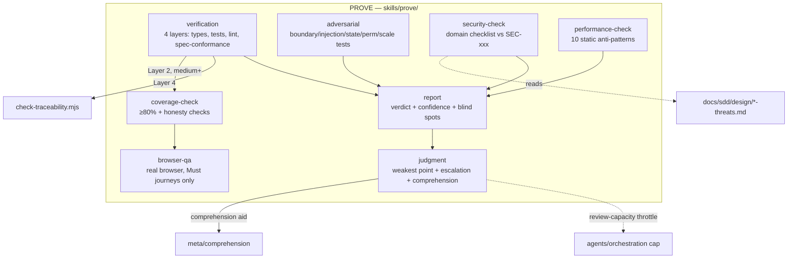

| Skill | What it does | Calls / feeds | Writes to |
|---|---|---|---|
| **verification** | 4 layers (parallel if multi-agent): Types (tsc/mypy/…), Tests (LOCAL-only hard stop, then suite + coverage-check at medium+), Lint (auto-fix), Spec Conformance (runs `check-traceability.mjs` first, then traces THINK requirements to tests); self-fixes failing layers up to 2 attempts | `build/test-plan` (env-safety rule), `prove/coverage-check`, `check-traceability.mjs` | aggregated 4-layer summary → feeds `prove/report` |
| **coverage-check** | Runs the stack's coverage command; gate default ≥80% line+branch; **honesty checks**: every FSD error flow tested, every High/Critical SEC tested, no `.only`/skip/always-true fakes, new-code coverage drag flagged, UI Must journeys browser-verified; never rounds FAIL to PASS | `build/test-plan` (command/threshold), `prove/browser-qa` | verdict + prioritized TICKET/TEST backlog list |
| **adversarial** | Generates tests across 7 attack categories (Boundary, Injection, State, Type Confusion, Permission, Scale, Environment), skipping irrelevant ones (no SQLi tests for a CLI) | — | tests as output |
| **security-check** | Domain-aware checklist (Web W1-8, CLI C1-5, API A1-8, Library L1-4, Mobile M1-4); cites the SEC-xxx each finding verifies/violates if a threat model exists; a control on paper but missing in the diff is a FAIL not N/A | `think/threat-model` (design-phase counterpart) | PASS/FAIL/N-A findings |
| **performance-check** | Static-only detection of 10 patterns (O(n²), N+1, missing pagination, unbounded memory, sync blocking, redundant computation, large bundle imports, missing DB index, unbounded cache, missing connection pool) | — | inline `PERFORMANCE CHECK:` report |
| **browser-qa** | Drives a real browser (host tools → Playwright MCP → in-repo runner) through Must-priority journeys only, by accessibility ref not coordinates; LOCAL-only hard stop; commits a durable spec for CI when possible | `build/test-plan` (env safety, Must/e2e journeys), `build/infra` (CI wiring), `setup-browser-mcp.mjs` | flips traceability rows green; committed Playwright/Cypress specs |
| **report** | Fixed-format Verdict/Confidence/Checks-run/You-should-verify/Not-tested/Key-decisions report, capped ~20 lines in standard mode; confidence is never rounded up when verification was partial | consumes verification's 4 layers + judgment's block | the report text itself |
| **judgment** | Post-verification human-comprehension gate: Explain-Back check (via comprehension aid), Plausibility Discount self-audit (mandatory "weakest point" line), Security Prior Escalation (auth/crypto/trust-boundary code flagged even if checks pass), Review-Capacity Throttle (won't stack another large diff on an unreviewed one) | `meta/comprehension`, `prove/report` (appends its block), `agents/orchestration` (cap rationale) | `### Judgment` block appended to the report |

---

## 6. META layer — `skills/meta/` (cross-cutting, not a phase)

These don't sit in the THINK→BUILD→PROVE sequence — they're invoked *from* many other skills and run continuously across a session.

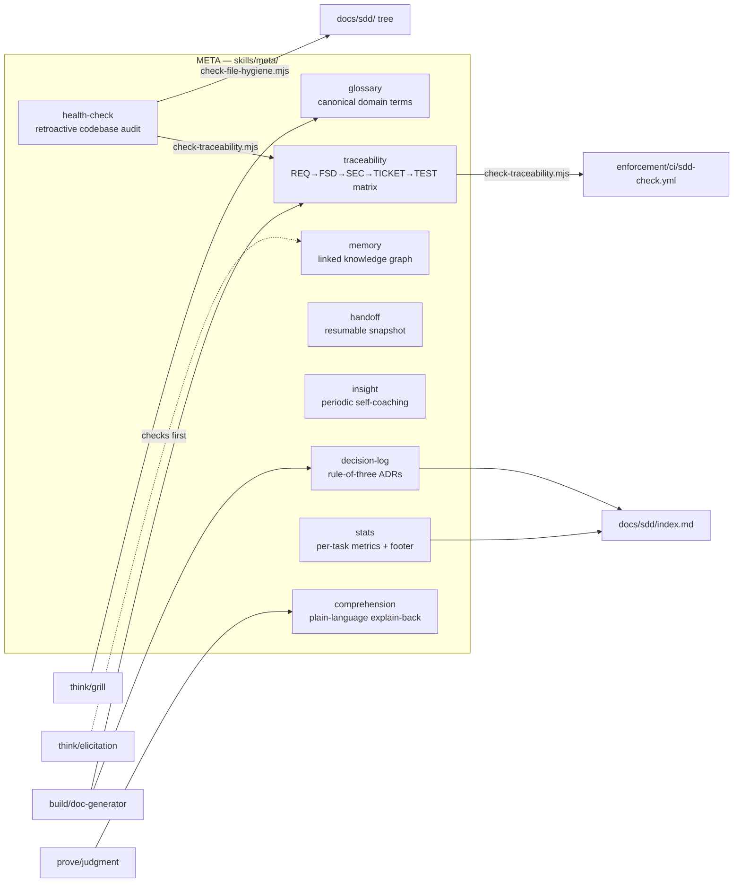

| Skill | What it does | Calls / feeds | Writes to |
|---|---|---|---|
| **comprehension** | Fixed-format post-BUILD explanation: What was built / How it works / Key decisions / Start reading here; capped 15 lines standard | consumed by `prove/judgment` | inline (not persisted) |
| **decision-log** | **Rule of three** gate (hard to reverse + surprising + real trade-off — all 3) before logging; one file per decision, write-once, `SUPERSEDED by #N` to change; file number IS the `ADR-N` id | `build/doc-generator` (if entry grows too big) | `docs/sdd/decisions/{NNN}-{slug}.md` + `index.md` link |
| **glossary** | Single source of truth for domain terms; created lazily on first term; challenges conflicting usage live, sharpens vague terms, cross-references code | fed by `grill`, `elicitation`, `doc-generator`, `decision-log` | `docs/sdd/glossary.md` |
| **handoff** | Compacts current state into one self-contained snapshot so a fresh agent/model can resume with zero conversation history; overwritten, not appended; acceptance test = "could a cheaper model continue from just this?" | points at `decisions/`, `index.md`, `traceability.md` | `docs/sdd/HANDOFF.md` (overwrite) |
| **health-check** | Retroactive, read-only scan of an *existing* codebase for anti-patterns/security/performance/convention drift/missing tests/dependency health; report only, never auto-fixes | `check-file-hygiene.mjs`, `meta/traceability`'s `check-traceability.mjs` | report only (no file) |
| **insight** | Every 5 tasks (or on request): "your tendencies" coaching summary from accumulated per-task notes — helpful-coach tone, not a critic; user-disableable | — | `docs/sdd/insights.md` |
| **memory** | Linked knowledge graph (`INDEX.md` + `<slug>.md` notes, `type: module\|concept\|gotcha\|how-to\|convention\|preference\|override\|pointer`); `INDEX.md` carries a rendered Mermaid `graph LR` of the `[[wikilink]]` structure (mechanically regenerated, capped ~40 nodes), not just a flat list; read index-first; captures durable facts + previously-answered questions so the user is never re-asked | `check-file-hygiene.mjs`; project `CLAUDE.md`/`AGENTS.md` should point here | `docs/sdd/memory/INDEX.md` + notes |
| **stats** | Per-task metrics (anti-patterns caught, security issues, scope deviations, docs generated…) → vibe-mode 1-line footer + monthly stats file + `index.md` Recent Activity (last 10) | — | `docs/sdd/stats/{YYYY-MM}.md`, `index.md` |
| **traceability** | Owns `docs/sdd/traceability.md`: one row per REQ with 🟢/🟠/🟡/🔴/⚪ status; global ID counters; **ship gate** — large/full work can't ship while a Must/Should row is red; gated by task size (large=full matrix, medium=lite inline trail, small/micro=skip) | `check-traceability.mjs` (bundled), `enforcement/ci/sdd-check.yml`, `doc-generator`'s ID spine | `docs/sdd/traceability.md` |

**Mechanical enforcement scripts** (the only executable code in the framework — zero dependencies, CI-wireable):

| Script | Lives in | Checks |
|---|---|---|
| `check-file-hygiene.mjs` | `skills/meta/health-check/` | `docs/sdd/` tree conventions: allowed root files/subdirs, per-directory filename patterns, frontmatter requirements, orphan-doc detection (every `design/`/`changes/` file must be in `index.md`) |
| `check-traceability.mjs` | `skills/meta/traceability/` | Spine orphans (REQ/SEC/FSD defined but not in matrix), broken refs, freelance tickets/tests (no upstream ID within 10 lines), duplicate ID definitions, dead relative markdown links |
| `check-parallel-safety.mjs` | `skills/agents/parallel-work/` | Parses ticket `Files likely touched:`/`Dependencies:`/`Status:`/`Claimed by:`; clusters zero-file-overlap tickets as parallel-safe, flags 1-2-file overlaps for human judgment; `--board` flag prints a live kanban. Read-only — "never spawns anything" |

---

## 7. Modes — `skills/modes/` (the ceremony dial)

One file per mode; each defines, for *every* skill above, exactly how it behaves at that ceremony level. This is the mechanism that lets the same pipeline run a hackathon prototype and a fintech production change without code duplication.

| Dimension | prototype | vibe | standard (default) | strict | emergency |
|---|---|---|---|---|---|
| Elicitation | skip | 0-1, auto-infer | adaptive 0-5 | 5+, confirm understanding | skip |
| Plan file | none | written, auto-approved | shown, wait for "go" | **must** be explicitly approved | none (post-fix retro) |
| Constraints | secrets only | auto-correct silently | flag + self-correct | pause + wait for approval | skip all |
| Anti-patterns | hallucinated API + secrets only | auto-fix silently | fix + note | report + fix after ack | skip |
| Doc generator | skip | silent | generate + show summary | full suite, review required | skip (post-fix report only) |
| Arch analyzer | skip | silent, CRITICAL only | full for new / consistency for existing | full + require approval | skip |
| Verification | smoke test only | layers 1-3 silently | all 4 layers | all 4 + manual checkpoint | smoke test only |
| Adversarial | skip | skip | 3-5 tests | 5-10+ tests | skip |
| Security check | secrets only | silent, CRITICAL only | full checklist | full + recommend manual review | critical items only |
| Judgment gate | skip | silent self-audit | full, comprehension aid | full + explicit user confirmation | weakest point noted for later |
| Trigger signal | "prototype", "MVP", "hackathon" | casual prompt, no quality bar stated | default | "production", "fintech", "compliance" | "down", "broken", "urgent", "ASAP" |

Full per-skill tables live in each `skills/modes/{mode}/SKILL.md` — the table above is the cross-section.

---

## 8. Constraints — `skills/constraints/` (domain rule packs)

Loaded by `build/constraints` in this order: **universal → domain-specific → project overrides (`config.md`) → `CLAUDE.md`/`AGENTS.md`**. Each rule carries a `CHECK: mechanical | judgment` tag that `build/model-router` uses to route it to a cheap or strong model tier.

| Pack | Rule count | Sample rules |
|---|---|---|
| **universal** | 10 | YAGNI, dependency limit (3/5/10 by size), no premature abstraction (needs 3+ real impls), no hardcoded secrets (non-negotiable), boundary validation only |
| **web** | 8 (W1-W8) | XSS/CSRF prevention, responsive 320-1920px, a11y basics, bundle awareness, error boundaries |
| **api** | 10 (API1-API10) | input validation, rate limiting, pagination, consistent error shape, idempotency keys, resource-level authorization |
| **cli** | 8 (C1-C8) | exit codes, `--help`, stderr for errors, respect `NO_COLOR`, config precedence, progress for >2s ops |
| **library** | 7 (LIB1-LIB7) | minimal API surface, semver discipline, tree-shaking, no side effects on import |
| **mobile** | 7 (M1-M7) | minimum permissions at time-of-use, offline awareness, 44/48pt touch targets, secure storage (Keychain/Keystore) |

---

## 9. Agents — `skills/agents/` (multi-agent orchestration)

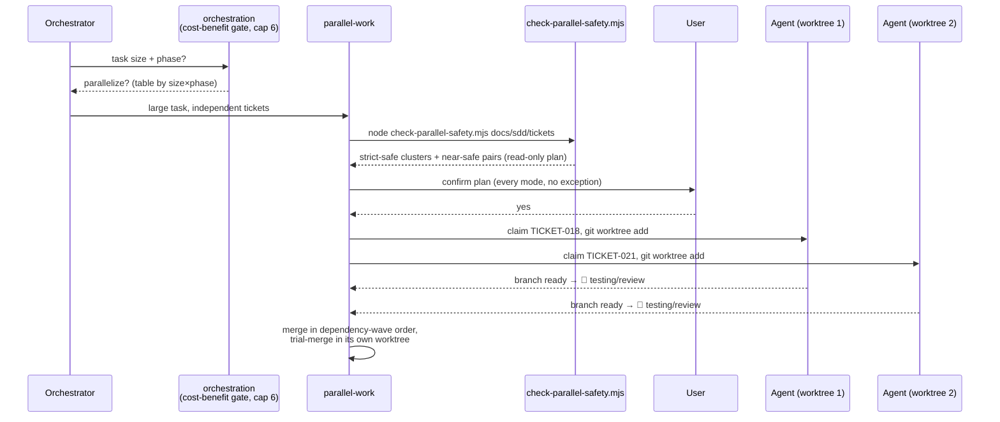

| Skill | What it does | Calls | Gating |
|---|---|---|---|
| **orchestration** | Cost-benefit gate (parallelize? by task-size × phase table); hard cap **6 parallel agents** (overridable only with explicit user consent + logged); conflict resolution protocol for shared files (patch requests, not direct writes, serialized in dependency order, re-verified after merge) | `agents/parallel-work`, `prove/judgment` (review-capacity backing the cap), `build/ticket-decomposition`, `build/change-plan`, `build/anti-patterns`, `build/constraints`, `think/arch-analyzer` (ADR-conflict analogy) | Runtime-dependent: real spawn on Claude Code, `config.toml` roles on Codex, sequential on OpenCode/Cursor |
| **parallel-work** | Implementation-phase-only protocol: git worktree isolation, ticket claiming (`**Claimed by:**` line), Kanban ticket-status flow as the coordination surface, merge in dependency-wave order, trial-merge always in its own worktree (never the main checkout) | `check-parallel-safety.mjs`, `agents/orchestration` (complements, doesn't replace), `build/ticket-decomposition` (ticket field format), `prove/judgment`, `build/git-workflow` | Requires locked contracts (FSD/schema/API) + genuinely independent tickets; plan confirmation required every mode, no exception |
| **model-strategy** | Same CHEAP/MID/STRONG tier routing table as `build/model-router`; advisory only, ignored in single-model environments | reads `CHECK:` metadata from constraint packs | multi-model environments only |
| **subagent-patterns** | Sequential-simulation patterns for runtimes without real concurrent agents (e.g. OpenCode) | referenced by `agents/orchestration` | single-agent runtimes |

---

## 10. Commands — `skills/commands/` (manual entry points)

The orchestrator usually triggers invisibly, but 5 commands let you start at a specific phase deliberately. Each has `disable-model-invocation: true` — they're never auto-triggered.

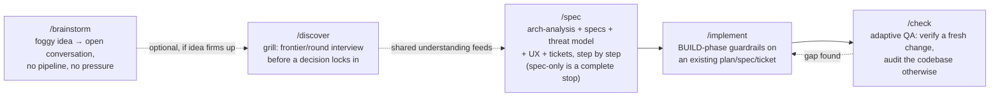

| Command | Frontmatter description | Branches to | Writes |
|---|---|---|---|
| **brainstorm** | "Mature a vague idea through open conversation and research — no plan, no spec, no pressure toward execution." | on request, borrows **grill**'s council seats for a light devil's-advocate pass | optionally `docs/sdd/design/{NNN}-{slug}-idea.md` |
| **discover** | "Investigate a decision before it locks in. Runs a frontier/round interview backed by SDD Pipeline's own judgment engines." | is the manual entry to **`think/grill`** | `docs/sdd/glossary.md`, `docs/sdd/decisions/` (rule-of-three gated) — never a plan file |
| **spec** | "Turn a settled decision into written specs — architecture analysis, FSD/SDS/PRD/ERD, threat model, UX, and (when large) vertical-slice tickets. Runs step by step, announcing and confirming each one. This is the SPEC step of the pipeline, not visual/UI design." | `think/arch-analyzer`, `think/ux-design`, `think/threat-model`, `build/doc-generator`, `build/ticket-decomposition` | `docs/sdd/design/`, `docs/sdd/design-system/design.md`, `docs/sdd/erd/`, `docs/sdd/tickets/`; stops honestly before BUILD if no execution signal |
| **implement** | "Execute an existing plan, spec, or ticket with build-time guardrails active." | `build/constraints`, `build/anti-patterns`, `build/change-plan`, `build/execution-guard`, `build/model-router` | working code + change summary |
| **check** | "Adaptive QA — verifies a fresh change if one exists, audits the whole codebase otherwise, always ends with an impact summary." | **VERIFY** branch (fresh diff exists) → `prove/verification` + adversarial + security-check + performance-check + judgment; **AUDIT** branch (no diff) → `meta/health-check`, read-only | `docs/sdd/reports/{date}-{slug}.md` (verify only) + always an impact digest from `meta/stats` |

---

## 11. Project file map (`docs/sdd/`)

Every skill's output lands in one convention-enforced tree, checked by `check-file-hygiene.mjs`:

```
docs/sdd/
├── index.md              ← read FIRST (relationship graph, updated by doc-generator, decision-log, stats)
├── config.md              project settings, mode default, SDLC override, constraint overrides
├── glossary.md            written live by: grill, elicitation, doc-generator, decision-log
├── traceability.md        owned by: meta/traceability  (large/full only; medium = lite inline trail)
├── HANDOFF.md             owned by: meta/handoff (overwritten, not appended)
├── stack-guide.md         owned by: think/stack-conventions
├── analytics.md           owned by: think/analytics-design
├── insights.md            owned by: meta/insight
├── memory/                owned by: meta/memory        → INDEX.md + <slug>.md notes
├── decisions/             owned by: meta/decision-log   → {NNN}-{slug}.md  (file number IS ADR-N)
├── design/                owned by: build/doc-generator, think/threat-model, think/ux-design
│                                     → {NNN}-{slug}-(fsd|sds|prd|threats|ux).md
├── ux-screens/             owned by: think/ux-design     → <flow-slug>.md, priority-tagged
├── design-system/          owned by: think/ux-design     → design.md (required entry doc) + free-form rest
├── erd/                    owned by: think/database-design → {NNN}-{slug}-erd.md
├── tickets/                owned by: build/ticket-decomposition → {feature-slug}/{NN}-{slug}.md
├── test-plans/             owned by: build/test-plan      → {NNN}-{slug}-tests.md
├── dod/                    owned by: build/doc-generator   → {NNN}-{slug}-dod.md
├── plans/current.md        owned by: orchestrator (overwritten each task)
├── plans/archive/           → {YYYY-MM-DD}-{NN}-{slug}.md
├── changes/                small/medium work → ONE dated self-contained file per topic
├── reports/                 owned by: prove/report, commands/check → {date}-{slug}.md
└── stats/                   owned by: meta/stats           → {YYYY-MM}.md
```

`docs/user/` (plain language) and `docs/dev/` (architecture/API reference) are separate, audience-split output of `build/doc-generator` — outside the `docs/sdd/` convention tree entirely.

---

## 12. Data Flow Diagrams (DFD)

Everything above is a *control*/*call* graph — who invokes whom. This section is a true DFD: external entities (squares), processes (numbered circles), and data stores (cylinders), connected by named, directional data flows. Three levels: **Level 0** (the whole system as one process), **Level 1** (the 5 top-level processes: Orchestrator + THINK/BUILD/PROVE/META), and **Level 2** (every individual skill inside each phase, decomposed).

Data-store legend used throughout (all under `docs/sdd/` unless noted):

| ID | Store | ID | Store | ID | Store |
|---|---|---|---|---|---|
| CFG | `config.md` | TIX | `tickets/` | GLO | `glossary.md` |
| MEM | `memory/` | TST | `test-plans/` | DEC | `decisions/` |
| PLN | `plans/` | TRC | `traceability.md` | RPT | `reports/` |
| DES | `design/` (FSD·SDS·PRD·threats·ux) | ERD | `erd/` | STA | `stats/` + `index.md` |
| UXS | `ux-screens/` | DOD | `dod/` | MISC | `stack-guide.md`, `analytics.md`, `insights.md`, `HANDOFF.md` |
| COD | the codebase itself (source, tests, git history) | CLA | `CLAUDE.md` / `AGENTS.md` (repo root, not `docs/sdd/`) | EXT | external web / docs (context7, official framework docs) |

### 12.1 Level 0 — Context Diagram

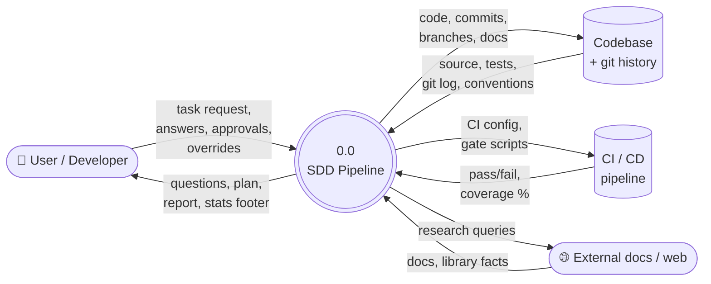

### 12.2 Level 1 — Top-Level Processes

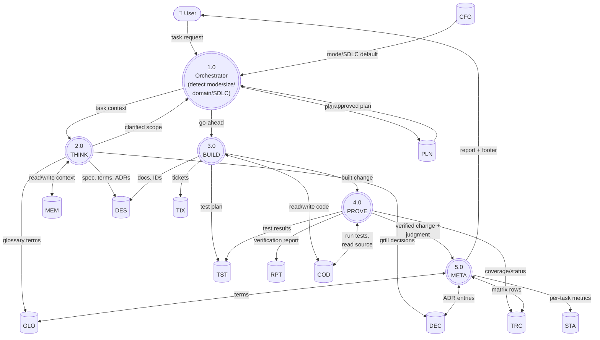

### 12.3 Level 2a — THINK decomposed (per skill)

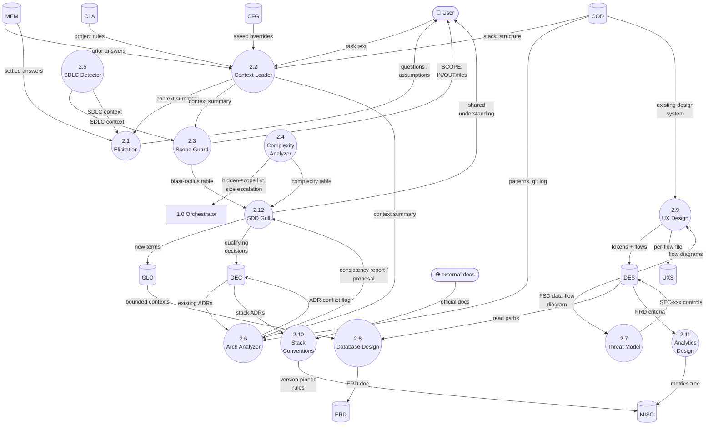

### 12.4 Level 2b — BUILD decomposed (per skill)

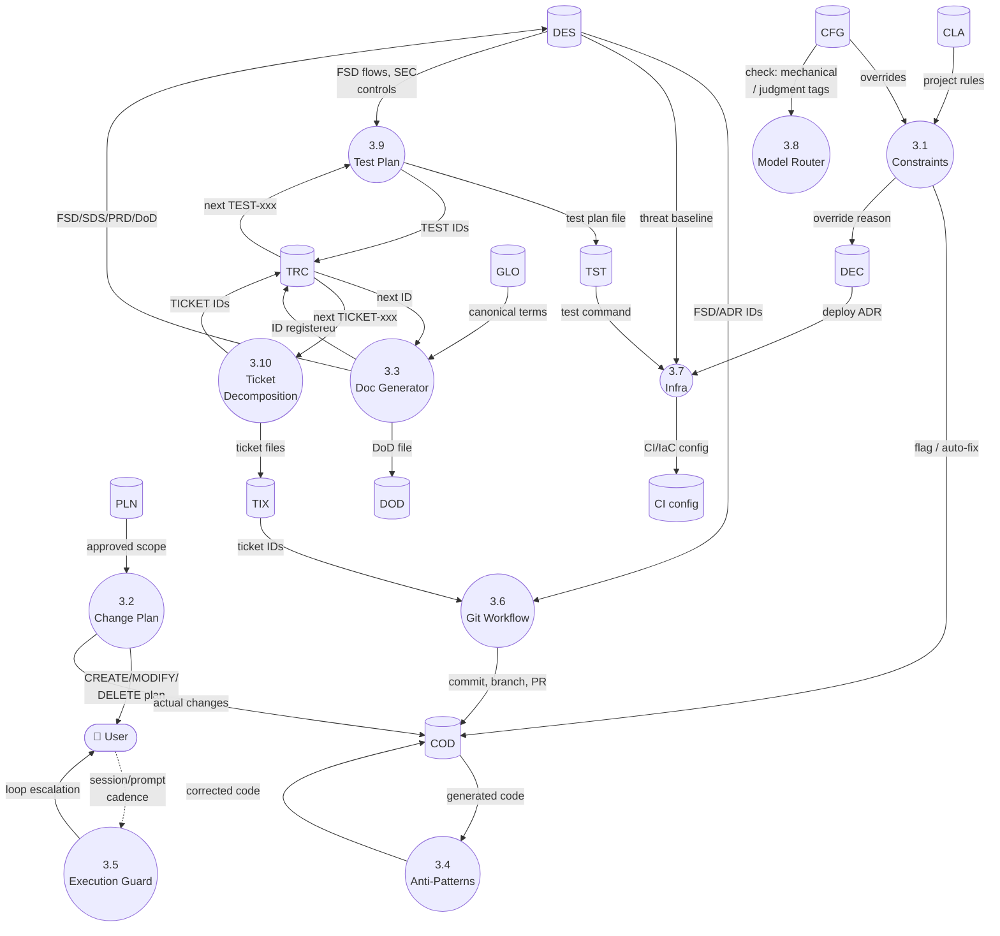

### 12.5 Level 2c — PROVE decomposed (per skill)

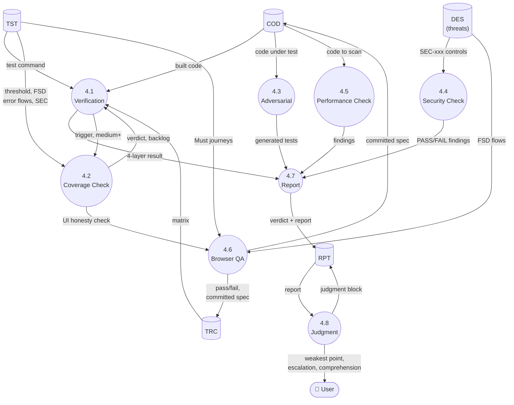

### 12.6 Level 2d — META decomposed (per skill)

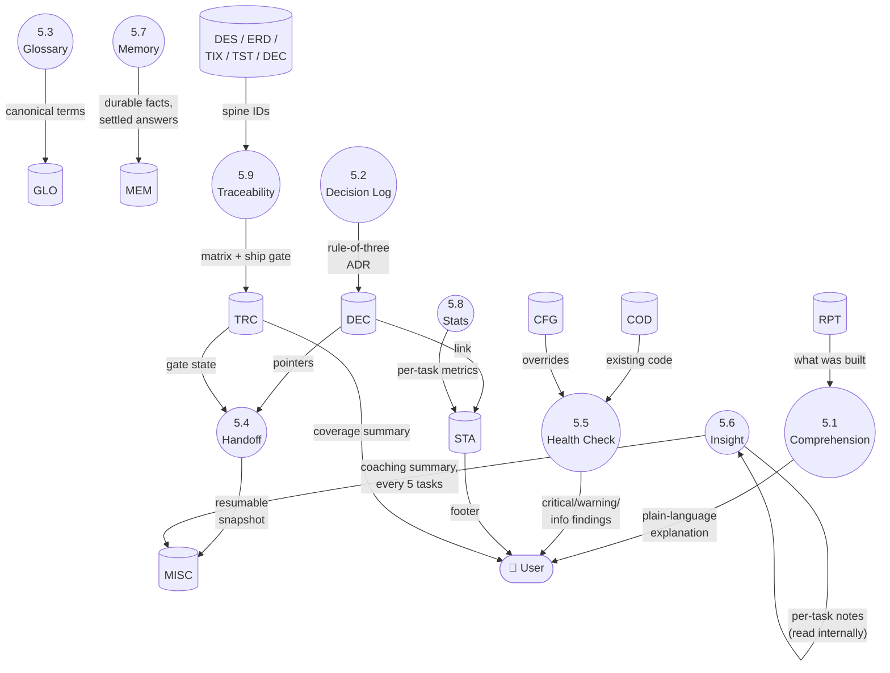

Read order for a newcomer: **12.1 → 12.2** to see the whole shape in under a minute, then whichever **12.3–12.6** matches the phase you're actually touching.

---

## 13. Cross-Agent Skill Discovery — Why Only 6 of 60 Are Invocable, Everywhere

This repo talks about "60 skills" throughout §§1-12 using SDD Pipeline's own internal vocabulary. In every AI coding tool's actual sense of the word "skill," there are only **6**: `orchestrator` and the 5 files under `skills/commands/`. This isn't a Claude Code-only limitation — it's a convention now shared across **Claude Code, OpenCode, Codex CLI, and Cursor**, all of which have converged on the same **Agent Skills** file format. The gate is structural, not platform-specific:

> A directory only counts as a "skill" if its `SKILL.md` has valid YAML frontmatter with a `name` and a `description`. Across the whole `skills/` tree (60 `SKILL.md` files total), exactly 6 have that frontmatter — `orchestrator/SKILL.md` and the 5 `commands/*/SKILL.md` files. The other 54 are plain markdown with no frontmatter block at all, by design: they're reference modules the 6 real skills read via file path when a specific step needs them, never standalone entries.

Verified against each tool's own documentation:

| Tool | Discovery mechanism | Where it scans | What happens to the 54 without frontmatter |
|---|---|---|---|
| **Claude Code** | `plugin.json`'s `skills` array (marketplace) or `.claude/skills/<name>/SKILL.md` (manual) | Only the 6 paths listed in `plugin.json` | Never registered — copied as file content only, read via path reference |
| **OpenCode** | Native skill scanner, requires `name` (alphanumeric+hyphens, matches dir name) + `description` (1-1024 chars) in frontmatter; unknown fields ignored | `.opencode/skills/`, `.claude/skills/`, `.agents/skills/` (+ global `~/.config/opencode/`, `~/.claude/`, `~/.agents/` equivalents) | Fail frontmatter validation → not discovered at all, invisible to the `<available_skills>` list injected into agent context at session start |
| **Codex CLI** | Same frontmatter requirement (`name` + `description` drive whether/when Codex auto-invokes); explicit picker via `/skills`, or `$name` to mention one directly | `.agents/skills/<name>/SKILL.md` (per this repo's own installer target) | Fail frontmatter validation → don't appear in the `/skills` picker or `$` mention list |
| **Cursor** (since the Jan 2026 Agent Skills release) | Same frontmatter requirement, including recognizing `disable-model-invocation: true` (the exact flag this repo's 5 commands use); manual invoke via `/` in Agent chat or pin as a Custom Mode; auto-invoke otherwise | `.cursor/skills/`, `.agents/skills/` (project) + `~/.cursor/skills/`, `~/.agents/skills/` (global); legacy compat also reads `.claude/skills/`, `.codex/skills/` | Fail frontmatter validation → don't appear in the Customize → Skills → "Agent Decides" list |

**A cross-compat side effect worth knowing**: both OpenCode's and Cursor's scan lists include `.agents/skills/` — exactly where this repo's installer puts the Codex CLI install (`./install/install.sh --agent codex`). So a project that installed SDD Pipeline for Codex already has it auto-discoverable by OpenCode *and* Cursor too, with zero extra install step, on any tool released after each added `.agents/skills/` compatibility.

**Net effect for the user, on every tool**: nobody is ever shown a menu of 60 items. Whatever skill-listing UI exists — Claude Code's `/` palette, Codex's `/skills` picker, OpenCode's `<available_skills>` context injection, Cursor's Customize → Skills panel — surfaces the same 6 entries. The 54 internal modules stay exactly what they were designed to be: content the orchestrator (or a command) reads by path when its own logic decides a specific step needs it, never a discoverable, invocable, or user-facing item on any platform.

**Fixed, not just flagged**: `--agent cursor` now installs the full skill tree into `.cursor/skills/sdd/` (same shape as `codex`/`opencode`), replacing the old behavior of dumping the whole tree as loose `.md` files into `.cursor/rules/` — a format Cursor's *Rules* system (which expects `.mdc` files) never actually loaded, despite the installer's own comments claiming "orchestrator only." Verified end-to-end in a scratch repo: `.cursor/skills/sdd/SKILL.md` and all 5 `commands/*/SKILL.md` now pass Cursor's/OpenCode's/Codex's folder-name-must-match-frontmatter-`name` validation.

**A second bug this surfaced**: `skills/orchestrator/SKILL.md` sits in a folder named `orchestrator`, but its own frontmatter says `name: sdd`. Claude Code's plugin-marketplace path doesn't care (it registers skills by path via `plugin.json`), but the native Agent Skills discovery on Claude Code's manual install, OpenCode, Codex, and Cursor all require the immediate parent folder to match `name:` exactly — so as installed, the orchestrator itself was failing discovery validation on all four. The installer now adds a small alias copy at each container's root (`install_orchestrator_alias()` in `install/install.sh`), one per target's actual destination — `~/.claude/skills/sdd/SKILL.md` (claude), `.claude/skills/sdd/SKILL.md` (claude-proj), `.agents/skills/sdd/SKILL.md` (codex), `.opencode/skills/sdd/SKILL.md` (opencode), `.cursor/skills/sdd/SKILL.md` (cursor) — so the folder name matches without renaming the canonical `skills/orchestrator/` path this repo's own cross-references and `.claude-plugin/plugin.json` depend on.

**Also fixed — internal path references now resolve**: every one of the 54 reference modules cross-references its siblings with paths like `skills/think/grill/SKILL.md`, written assuming a project-root-relative `skills/` directory (true only when running straight out of this repo). Since the `codex`/`opencode`/`cursor`/`generic` installers copy that tree into a *nested* destination (`.agents/skills/sdd/`, `.cursor/skills/sdd/`, a custom `--dest`), those references used to point nowhere once installed elsewhere. `install/install.sh` now rewrites every literal `skills/` prefix — across every copied `.md`/`.mjs` file, plus the copied `AGENTS.md` — to the actual install location right after copying (`rewrite_skill_paths()` / `rewrite_skill_paths_in_file()`), computed relative to wherever `AGENTS.md` itself lands (so it also works for a `--dest` whose parent directory isn't the project root). Verified by installing into a scratch repo for every target (`codex`, `opencode`, `cursor`, `claude-proj`, `generic` with both a `skills`-named and non-`skills`-named `--dest`) and mechanically checking that every rewritten reference resolves to a real file or directory on disk — zero broken references in each case, and `--update` re-runs the rewrite from the pristine source each time (no double-rewrite drift).

Sources: [Agent Skills — OpenCode docs](https://opencode.ai/docs/skills/) · [Build skills — Codex / ChatGPT Learn](https://developers.openai.com/codex/skills) · [Slash commands in Codex CLI — OpenAI Developers](https://developers.openai.com/codex/guides/slash-commands) · [Agent Skills — Cursor Docs](https://cursor.com/docs/skills)
