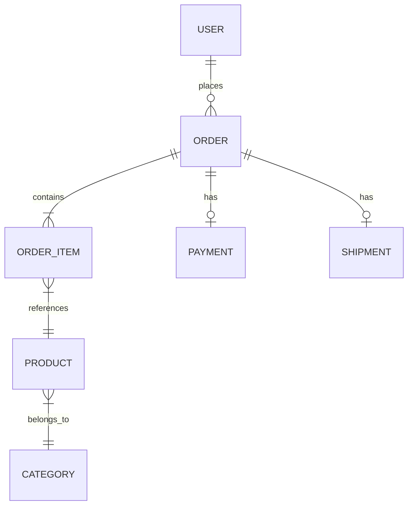

# Example: Starting a New Project with SDD Pipeline

This walkthrough shows SDD Pipeline in **standard mode** setting up a new project from scratch, including architecture proposal.

## Scenario

User prompt: "Build an e-commerce API for a small online store. We're a team of 3."

## What Happens

### 1. THINK Phase (deep)

**Orchestrator detects:**
- Mode: standard
- Size: large (new system)
- Domain: api
- SDLC: solo (no project signals — new project)
- Architecture: none (new project → propose)

**Elicitation** asks 3-5 questions:
```
1. What products are you selling? (Physical, digital, or both?)
   → Helps scope: shipping logic, download management, etc.

2. Payment provider preference? (Stripe, PayPal, manual?)
   → Determines integration complexity.

3. Do you need admin panel, or API-only for now?
   → Scopes frontend requirements.

4. Expected scale in first 6 months? (Hundreds or thousands of orders/day?)
   → Influences architecture choice.

5. Database preference? (PostgreSQL, MySQL, MongoDB?)
   → Or should SDD Pipeline recommend?
```

User answers: Physical products, Stripe, API-only for now, hundreds of orders/day, recommend database.

**Architecture Analyzer** proposes:

```markdown
## Architecture Proposal

**Recommended**: Modular Monolith + Layered Architecture
**Domain**: API (e-commerce)
**Scale**: Small-medium (team of 3, hundreds of orders/day)

### Why This Architecture
1. Team of 3 → microservices overhead not justified
2. Hundreds/day → single server handles easily
3. Modular monolith → clear boundaries, can extract services later
4. Layered → well-understood, fast onboarding for team members

### Alternatives Considered
- Microservices: Overkill for team of 3 and current scale
- Serverless: Good for variable load but adds complexity for team unfamiliar with it
- Clean Architecture: Overhead not justified for CRUD-heavy e-commerce

### Proposed Structure
src/
├── modules/
│   ├── products/     (CRUD, categories, search)
│   ├── orders/       (cart, checkout, order management)
│   ├── payments/     (Stripe integration)
│   ├── users/        (auth, profiles)
│   └── shipping/     (rates, tracking)
├── shared/           (middleware, utils, error handling)
├── infrastructure/   (database, external APIs)
└── api/              (routes, request/response handling)

### Database: PostgreSQL
- Relational data (orders → items → products) fits naturally
- ACID transactions for payment flows
- JSON columns for flexible product attributes
- Well-supported, team likely familiar
```

**Complexity Analyzer** flags:
```
Hidden complexity:
- Payment processing: Stripe webhooks, idempotency, error handling
- Order state machine: pending → paid → shipped → delivered → returned
- Inventory management: race conditions on concurrent purchases
Escalated from large to large-complex.
```

### 2. Plan Written

Full plan with architecture, module breakdown, implementation phases.

Documents to generate:
- PRD (product requirements)
- SDS (architecture + design)
- ERD (database schema)
- FSD (per module, generated as each module is built)
- DoD (project-level)

User reviews and approves.

### 3. BUILD Phase

**Doc Generator** creates:

**PRD** (`docs/sdd/specs/001-ecommerce-api-prd.md`):
```
Problem: Small online store needs API for product catalog, orders, payments.
Solution: RESTful API with Stripe integration, PostgreSQL backend.
Must Have: Product CRUD, cart, checkout, Stripe payments, order tracking.
Nice to Have: Search, filtering, discount codes.
Out of Scope: Admin panel, frontend, email notifications (v2).
```

**ERD** (`docs/sdd/erd/001-ecommerce-erd.md`):


**SDS** (`docs/sdd/specs/001-ecommerce-api-sds.md`):
Architecture decisions, module boundaries, API design patterns.

**DoD** (`docs/sdd/dod/001-ecommerce-api-dod.md`):
Project-level definition of done.

Then builds the actual code module by module.

### 4. PROVE Phase

Full verification suite for each module as it's built.

### 5. Output

All artifacts linked in `docs/sdd/index.md`:
```
## Documents
- [PRD: E-commerce API](design/001-ecommerce-api-prd.md)
- [SDS: E-commerce API](design/001-ecommerce-api-sds.md)
- [ERD: E-commerce](erd/001-ecommerce-erd.md)
- [DoD: E-commerce API](dod/001-ecommerce-api-dod.md)

## Decisions
- [001: Modular Monolith](decisions/001-modular-monolith.md) → SDS
- [002: PostgreSQL](decisions/002-postgresql.md) → ERD
- [003: Stripe Integration](decisions/003-stripe.md) → design/payments module
```

## Key Takeaways

1. New project triggers architecture proposal with clear reasoning
2. Database recommendation based on domain requirements
3. Full doc suite generated: PRD → SDS → ERD → DoD
4. Hidden complexity identified upfront (payments, inventory race conditions)
5. Everything connected in index.md for easy navigation
6. Modular approach — can be built incrementally
