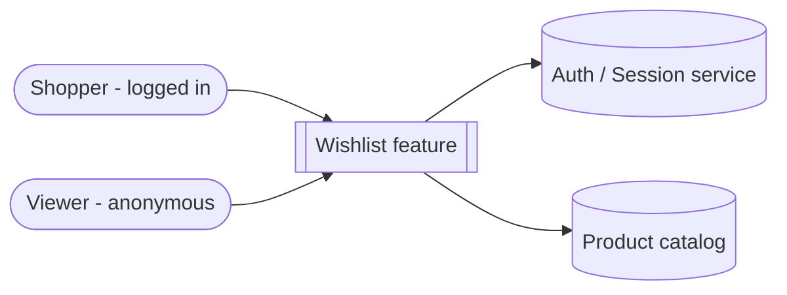
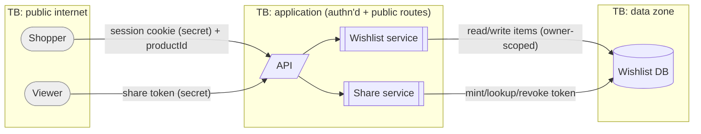
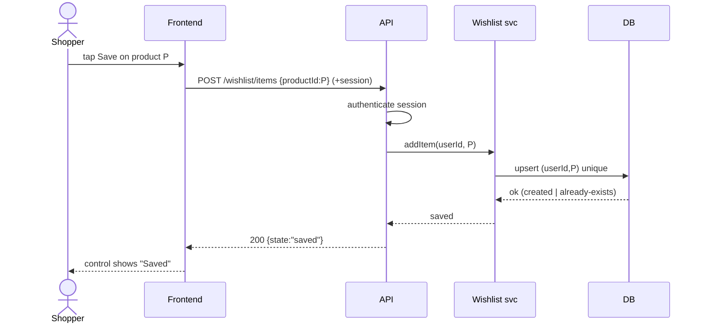
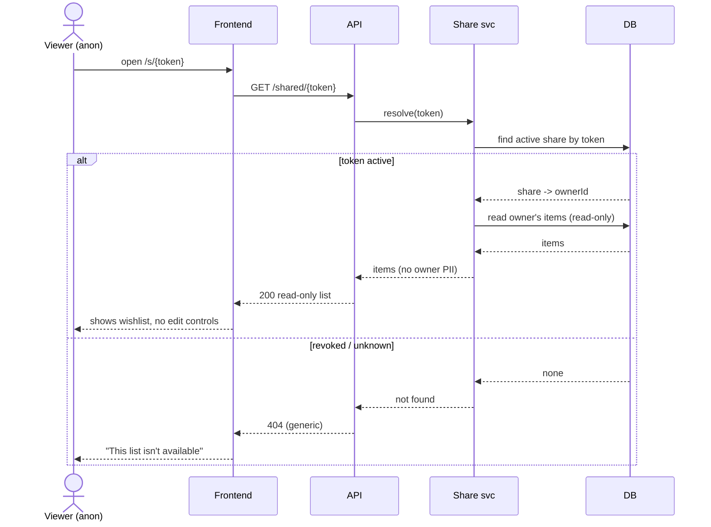
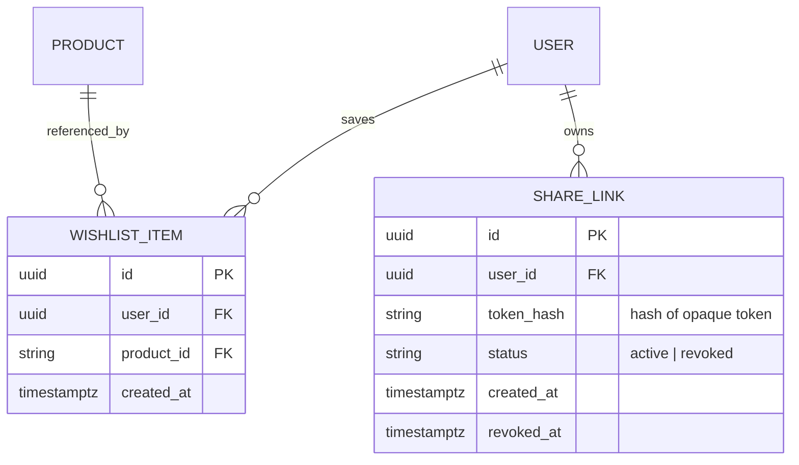
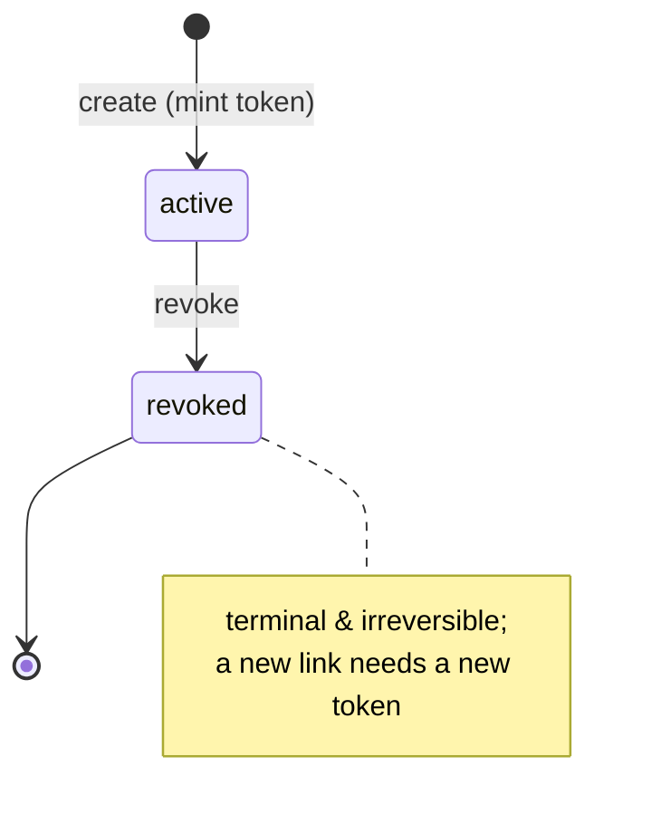

# Diagrams — Wishlist + Shareable Link

> **Plain-language summary:** Pictures of how the wishlist works: who talks to
> what (context), how data moves across security boundaries (DFD — feeds the
> threat model), the step-by-step of the main journeys (sequences), the data
> shape (ERD), and the life of a share link (state).

## 1. Context diagram

## 2. Data-flow diagram (DFD) with trust boundaries

## 3. Sequence — Save a product (REQ-001, FSD-001)

## 4. Sequence — View a shared wishlist (REQ-007, FSD-011)

## 5. ERD

## 6. State — Share link lifecycle

