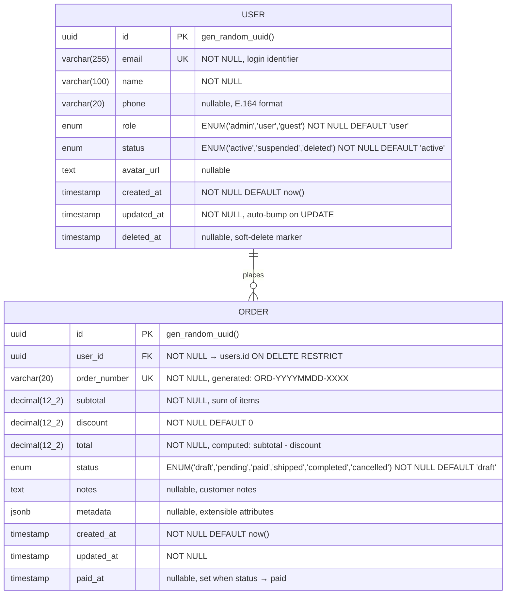
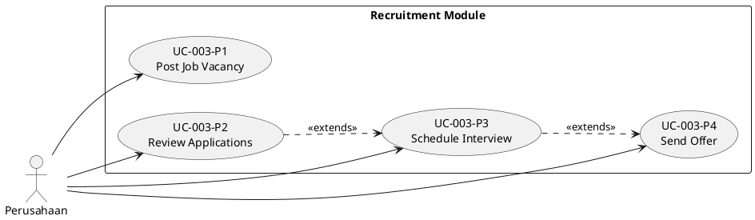
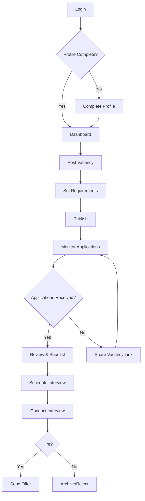
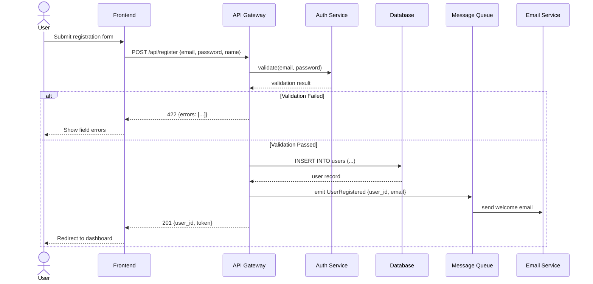
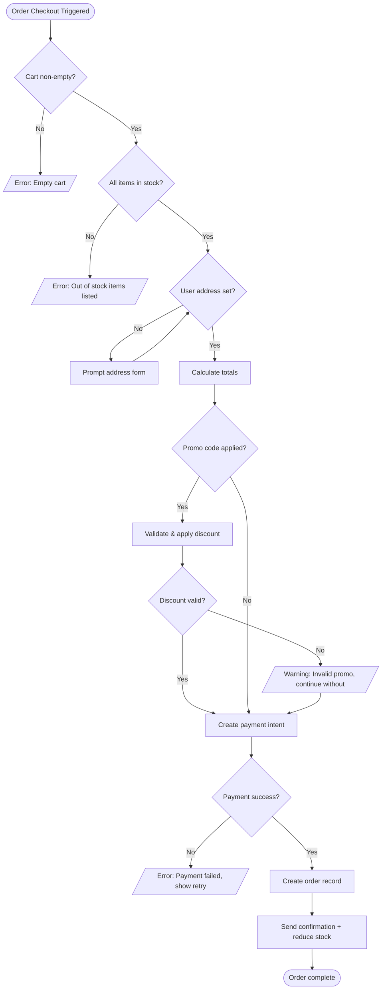

# Document Format Templates

Companion reference for `skills/build/doc-generator/SKILL.md` — the full per-document templates. The main skill holds trigger rules, file locations/numbering, and mode behavior; this file holds the shapes.


All documents are short, focused, and actionable. NOT enterprise bloatware.

### FSD — Functional Specification Document

**Durability rule**: never reference file paths or line numbers in the FSD. Code moves; behavior descriptions don't go stale the same way. Describe interfaces and behavior, not implementation location. The one exception: a short code snippet that precisely encodes a decision (e.g., a type signature) is fine — a `path/to/file.ts:42` pointer is not.

```markdown
# FSD: [Feature Name]

**Date**: [auto]
**Updated**: [auto]
**Version**: v1
**Status**: DRAFT | APPROVED | IMPLEMENTED

## Problem Statement
[What problem does this solve, for whom, and why now. 2-3 sentences.]

## Solution
[What we're building, from the user/caller's perspective. 2-3 sentences.]

## User Stories
- As a [role], I want [action], so that [benefit]
- As a [role], I want [action], so that [benefit]

(Exhaustive — cover every user-facing path this feature touches, not just the primary one.)

## Implementation Decisions
[Modules involved, their interfaces, schema shape, API contracts — described behaviorally.
No file paths, no line numbers. If a decision is precisely captured by a type signature or
example payload, include that snippet.]

- [Decision 1]: [what, and the interface/contract it implies]
- [Decision 2]: [what, and the interface/contract it implies]

## Error & Alternate Flows
[Every non-happy path: invalid input, authorization denial, empty/max states,
downstream failure. Number them as sub-IDs (### FSD-NNN.2 — …) when the matrix
or a test needs to point at one specifically. Each of these becomes an
edge/negative test in the test plan — an FSD error flow with no test is a red
row in the traceability matrix.]

## Testing Decisions
[What good tests look like for this feature: which modules need interface-level tests,
what prior art in the codebase to follow, what's explicitly NOT going to be tested and why.]

## Out of Scope
- [What this does NOT include]

## Further Notes
[Anything that doesn't fit above but matters — open questions, follow-up work, caveats.]
```

**Max length**: 1 page. If it's longer, it's over-specified. If you're tempted to add file paths for precision, that's a signal you need a code snippet instead, not a location pointer.

### SDS — Software Design Specification

```markdown
# SDS: [Component/Change Name]

**Task**: [one-line description]
**Date**: [auto]
**Updated**: [auto]
**Version**: v1
**Status**: DRAFT | APPROVED | IMPLEMENTED
**Architecture**: [detected or proposed pattern]

## Overview
[What this changes architecturally. 2-3 sentences.]

## Current State
[How it works now. Brief.]

## Proposed Design
[How it will work. Include structure.]

### Component Diagram
[Simple text diagram or Mermaid]

### Data Flow
[How data moves through the system]

## Key Decisions
| Decision | Choice | Why | Alternative |
|----------|--------|-----|-------------|
| [D1] | [Choice] | [Rationale] | [What we didn't pick] |

## Impact
- **Scope of change**: [which modules/interfaces, described behaviorally — not a file list]
- **Breaking changes**: [yes/no, what]
- **Migration needed**: [yes/no, how]

## Risks
- [Risk 1]: [Mitigation]
```

**Max length**: 1.5 pages. Same durability rule as FSD — describe modules and interfaces, not file paths. Key Decisions that pass the rule-of-three gate (`skills/meta/decision-log/`) should also get their own ADR file, with this SDS referenced from it.

### PRD — Product Requirements Document

```markdown
# PRD: [Product Feature Name]

**Date**: [auto]
**Updated**: [auto]
**Version**: v1
**Status**: DRAFT | APPROVED | IMPLEMENTED
**Priority**: HIGH | MEDIUM | LOW

## Problem
[What problem does this solve? Who has this problem? 2-3 sentences.]

## Solution
[What we're building. User perspective. 2-3 sentences.]

## User Stories
- As a [role], I want [action] so that [benefit]
- As a [role], I want [action] so that [benefit]

## Success Metrics
- [How do we know this worked?]

## Requirements
| ID | Requirement | Priority |
|----|-------------|----------|
| REQ-001 | [Requirement, one sentence, testable] | Must |
| REQ-002 | [Requirement] | Should |
| REQ-003 | [Requirement] | Nice |
| REQ-NF-001 | [Non-functional: p95 latency, capacity, availability target] | Must |

### Out of Scope
- [What we're explicitly not doing]
```

**Max length**: 1 page. This is NOT a 20-page enterprise PRD.

**REQ IDs are item-level and global** (counter in `docs/sdd/traceability.md`) — every Must/Should REQ must eventually reach a passing test through the traceability matrix. Priority uses Must/Should/Nice so the ship gate knows which gaps block.

### ERD — Entity Relationship Diagram (Field-Level)

The ERD is **field-level complete** by default — every column, every type, every constraint. A skeleton ERD with 4 example fields is not useful; a developer needs the full picture to write migrations and queries. If the entity has enums, list the values. If a field has business rules (soft-delete, auto-timestamp, computed), note them.

```markdown
# ERD: [Database Context]

**Date**: [auto]
**Updated**: [auto]
**Version**: v1
**Status**: DRAFT | APPROVED | IMPLEMENTED
**Database**: [PostgreSQL/MySQL/MongoDB/etc.]
**Refs**: [FSD-xxx, UC-xxx — which specs define the entities below]

## Diagram



## Entity Details

### USER (Refs: UC-001-admin, FSD-001.1)
| Column | Type | Constraints | Notes |
|--------|------|-------------|-------|
| id | uuid | PK, auto-gen | `gen_random_uuid()` |
| email | varchar(255) | UNIQUE, NOT NULL | Login identifier, lowercase-normalized |
| name | varchar(100) | NOT NULL | Display name |
| phone | varchar(20) | nullable | E.164 format (+628xxx) |
| role | enum | NOT NULL, DEFAULT 'user' | Values: `admin`, `user`, `guest` |
| status | enum | NOT NULL, DEFAULT 'active' | Values: `active`, `suspended`, `deleted` |
| avatar_url | text | nullable | S3/CDN URL |
| created_at | timestamp | NOT NULL, DEFAULT now() | Immutable after creation |
| updated_at | timestamp | NOT NULL | Auto-bumped on every UPDATE |
| deleted_at | timestamp | nullable | Soft-delete: non-null = deleted, filtered by default |

**Business rules**: soft-delete via `deleted_at` (never hard-delete user records). Status `suspended` blocks login but preserves data. Role changes logged in audit trail.

### ORDER (Refs: UC-003-buyer, FSD-003.2)
| Column | Type | Constraints | Notes |
|--------|------|-------------|-------|
| id | uuid | PK, auto-gen | |
| user_id | uuid | FK → users.id, NOT NULL | ON DELETE RESTRICT (cannot delete user with orders) |
| order_number | varchar(20) | UNIQUE, NOT NULL | Generated: `ORD-YYYYMMDD-XXXX` |
| subtotal | decimal(12,2) | NOT NULL | Sum of line items |
| discount | decimal(12,2) | NOT NULL, DEFAULT 0 | Applied promo/coupon amount |
| total | decimal(12,2) | NOT NULL | Computed: `subtotal - discount`, enforced by CHECK |
| status | enum | NOT NULL, DEFAULT 'draft' | Values: `draft` → `pending` → `paid` → `shipped` → `completed` / `cancelled` |
| notes | text | nullable | Free-text from customer |
| metadata | jsonb | nullable | Extensible key-value for integrations |
| created_at | timestamp | NOT NULL, DEFAULT now() | |
| updated_at | timestamp | NOT NULL | |
| paid_at | timestamp | nullable | Set atomically when status transitions to `paid` |

**Enum values — status transitions** (invalid transitions rejected by application):
`draft` → `pending` (checkout submitted) → `paid` (payment confirmed) → `shipped` (fulfillment) → `completed` (delivered)
`pending`/`paid` → `cancelled` (by user or admin)

## Relationships
| From | To | Cardinality | FK | On Delete | Notes |
|------|----|-------------|-----|-----------|-------|
| USER | ORDER | 1:N | `orders.user_id` | RESTRICT | Cannot orphan orders |

## Indexes
| Table | Column(s) | Type | Rationale |
|-------|-----------|------|-----------|
| users | email | UNIQUE | Login lookup |
| users | status | B-tree | Filter active users |
| users | deleted_at | B-tree (partial, WHERE NULL) | Soft-delete default filter |
| orders | user_id | B-tree | User's order list |
| orders | order_number | UNIQUE | Order lookup by number |
| orders | status, created_at | Composite B-tree | Dashboard filtering + sorting |

## Migration Notes
- [Sequence of migrations, rollback strategy, data backfill if needed]
```

**Key differences from a skeleton ERD**: every column has type + constraint + notes. Enums list all values with transition rules. Relationships table includes ON DELETE behavior. Indexes table includes rationale. Entity sections include `Refs:` back to the UC/FSD that define the entity's behavior — this is the cross-reference enforcement rule in action.

### DoD — Definition of Done

```markdown
# DoD: [Task Name]

**Date**: [auto]
**Updated**: [auto]
**Version**: v1
**Status**: DRAFT | APPROVED | IMPLEMENTED

## Checklist
- [ ] Code implements all acceptance criteria
- [ ] Tests written and passing
- [ ] No new anti-patterns introduced
- [ ] Security checklist completed (if applicable)
- [ ] Performance acceptable (no O(n²), no N+1)
- [ ] Documentation updated (if public API changed)
- [ ] Code reviewed / verification report generated
- [ ] [Task-specific criterion]
- [ ] [Task-specific criterion]

## Verification
- **Type safety**: [pass/fail]
- **Tests**: [X/Y passing]
- **Lint**: [pass/fail]
- **Security**: [pass/fail/N/A]
```

### Test Plan

Full behavior (5 test classes, TEST-xxx anatomy, LOCAL-only environment safety, coverage floor) lives in `skills/build/test-plan/SKILL.md` — read it when writing a real test plan. The shape:

```markdown
# Test Plan: [Feature Name]

**Date**: [auto]
**Updated**: [auto]
**Version**: v1
**Status**: DRAFT | APPROVED | IMPLEMENTED
**Coverage Target**: ≥80% line + branch (tool + exact command here)
**Test env**: [command + env file — must be local/ephemeral, see test-plan skill]

## Cases (label every case with a class: happy / regression / edge-negative / e2e / non-functional)

### TEST-030 — [what it proves]  [class: happy + edge]
Proves: FSD-003.1 · Ticket: TICKET-012 · Level: unit+integration
Given: [preconditions/fixtures]
When: [action]
Then: [observable outcome — behavior, not internals]

## Not Tested (Blind Spots)
- [What we can't or won't test, and why]
```

### Use Case Spec — Per-Role (Large + Multi-Role Only)

One file per actor role: `uc-{role}.md`. Each file captures every use case that involves this role, with a PlantUML use case diagram at the top and a structured UC table below.

```markdown
# Use Cases: [Role Name]

**Date**: [auto]
**Updated**: [auto]
**Version**: v1
**Status**: DRAFT | APPROVED | IMPLEMENTED
**Feature**: [NNN]-[slug]
**Refs**: FSD-[NNN], PRD-[NNN]

## Use Case Diagram



## Use Case Table

| UC ID | Use Case | Precondition | Main Flow | Postcondition | Priority |
|-------|----------|-------------|-----------|---------------|----------|
| UC-003-P1 | Post Job Vacancy | Company profile complete, verified | 1. Fill vacancy form 2. Set requirements 3. Publish | Vacancy visible to job seekers | Must |
| UC-003-P2 | Review Applications | ≥1 application received | 1. Open applicant list 2. Filter/sort 3. Mark shortlist | Applicants categorized | Must |
| UC-003-P3 | Schedule Interview | Applicant shortlisted | 1. Pick applicant 2. Set date/time 3. Send invite | Interview scheduled, notification sent | Must |
| UC-003-P4 | Send Offer | Interview completed | 1. Select candidate 2. Set terms 3. Send offer letter | Offer sent, status updated | Should |

## Alternate & Error Flows

| UC ID | Scenario | Trigger | System Response |
|-------|----------|---------|-----------------|
| UC-003-P1 | Incomplete profile | Company tries to post without completing profile | Block with link to profile completion |
| UC-003-P2 | Zero applications | Company opens empty applicant list | Show empty state with "share vacancy" CTA |
```

**Rules**: UC IDs follow the pattern `UC-{NNN}-{role-initial}{seq}` — the feature number ties it to the spec folder, the role initial keeps it unique across roles. Every UC must have a corresponding test in the test plan.

### Process Flow — Per-Role + End-to-End (Large + Multi-Role Only)

Per-role flows show one actor's journey through the system. The cross-actor end-to-end flow (`flow-e2e.md`) shows how all roles interact in a complete business process.

```markdown
# Process Flow: [Role Name] — [Feature/Process Name]

**Date**: [auto]
**Updated**: [auto]
**Version**: v1
**Status**: DRAFT | APPROVED | IMPLEMENTED
**Refs**: UC-[NNN]-[role], FSD-[NNN]

## [Role] Flow



## Decision Points

| Node | Condition | Yes Path | No Path |
|------|-----------|----------|---------|
| Profile Complete? | All required company fields filled | Dashboard | Complete Profile form |
| Applications Received? | ≥1 applicant for this vacancy | Review & Shortlist | Share vacancy link |
| Hire? | Interview passed, budget approved | Send Offer | Archive candidate |

## Cross-Actor Touchpoints
- **[Node]** → triggers notification to [other role] (Refs: flow-{other-role}.md)
```

**For `flow-e2e.md`**: use a `sequenceDiagram` or swimlane `flowchart` showing all actors' interactions in temporal order. Keep it to the happy path — alternate flows live in the per-role files.

### Sequence Diagram (Medium+ Multi-Service/Multi-Actor)

Embedded in its own file when the interaction is complex enough to warrant it, or inline in the SDS when it's the only sequence worth showing.

```markdown
# Sequence: [Interaction Name]

**Date**: [auto]
**Updated**: [auto]
**Version**: v1
**Status**: DRAFT | APPROVED | IMPLEMENTED
**Refs**: SDS-[NNN], FSD-[NNN].[sub]

## Diagram



## Participants

| Participant | Type | Notes |
|-------------|------|-------|
| Frontend | SPA (React) | Handles form validation client-side |
| API Gateway | REST | Rate-limited, validates JWT |
| Auth Service | Internal | Password hashing (bcrypt), token generation |
| Database | PostgreSQL | Users table (see ERD-001) |
| Message Queue | Redis/BullMQ | Async processing, retry on failure |
| Email Service | External (SendGrid) | Templated emails, delivery tracking |

## Error Scenarios

| Step | Error | Response | Retry? |
|------|-------|----------|--------|
| DB INSERT | Duplicate email | 409 Conflict | No — user error |
| Queue emit | Queue unavailable | Log + retry 3x | Yes — background |
| Email send | Delivery failure | Log, don't block registration | No — async |
```

### Activity Diagram (Medium+ Technical Process Detail)

For processes with branching logic, parallel forks, guard conditions, or complex validation chains.

```markdown
# Activity: [Process Name]

**Date**: [auto]
**Updated**: [auto]
**Version**: v1
**Status**: DRAFT | APPROVED | IMPLEMENTED
**Refs**: FSD-[NNN].[sub], UC-[NNN]-[role]

## Diagram



## Validation Chain

| Step | Guard Condition | Pass | Fail | Refs |
|------|----------------|------|------|------|
| V1 | Cart has ≥1 item | Continue | 400: empty cart | FSD-003.1 |
| V2 | All items `stock > 0` | Continue | 409: list out-of-stock items | FSD-003.3 |
| V3 | User has saved address | Continue | Show address form | UC-003-B2 |
| V4 | Promo code present | Validate | Skip discount | FSD-003.4 |
| V5 | Promo valid & not expired | Apply discount | Warning, continue without | FSD-003.4 |
| V6 | Payment gateway returns success | Create order | Show retry with error msg | FSD-003.5 |

## Side Effects
| After step | Action | Async? |
|-----------|--------|--------|
| CONFIRM | Reduce stock atomically | No — same transaction |
| NOTIFY | Send email confirmation | Yes — queue |
| NOTIFY | Send push notification | Yes — queue |
```

