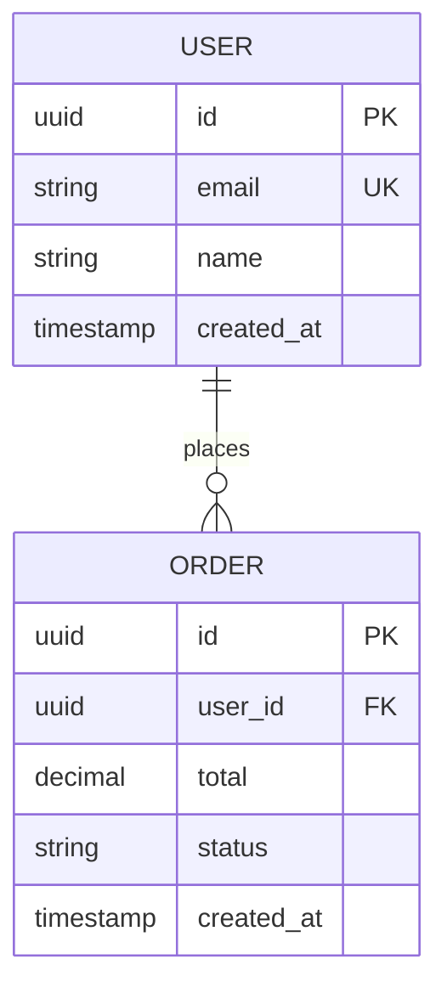

# Document Format Templates

Companion reference for `skills/build/doc-generator/SKILL.md` — the full per-document templates. The main skill holds trigger rules, file locations/numbering, and mode behavior; this file holds the shapes.


All documents are short, focused, and actionable. NOT enterprise bloatware.

### FSD — Functional Specification Document

**Durability rule**: never reference file paths or line numbers in the FSD. Code moves; behavior descriptions don't go stale the same way. Describe interfaces and behavior, not implementation location. The one exception: a short code snippet that precisely encodes a decision (e.g., a type signature) is fine — a `path/to/file.ts:42` pointer is not.

```markdown
# FSD: [Feature Name]

**Date**: [auto]
**Status**: DRAFT | APPROVED | IMPLEMENTED

## Problem Statement
[What problem does this solve, for whom, and why now. 2-3 sentences.]

## Solution
[What we're building, from the user/caller's perspective. 2-3 sentences.]

## User Stories
- As a [role], I want [action], so that [benefit]
- As a [role], I want [action], so that [benefit]

(Exhaustive — cover every user-facing path this feature touches, not just the primary one.)

## Implementation Decisions
[Modules involved, their interfaces, schema shape, API contracts — described behaviorally.
No file paths, no line numbers. If a decision is precisely captured by a type signature or
example payload, include that snippet.]

- [Decision 1]: [what, and the interface/contract it implies]
- [Decision 2]: [what, and the interface/contract it implies]

## Error & Alternate Flows
[Every non-happy path: invalid input, authorization denial, empty/max states,
downstream failure. Number them as sub-IDs (### FSD-NNN.2 — …) when the matrix
or a test needs to point at one specifically. Each of these becomes an
edge/negative test in the test plan — an FSD error flow with no test is a red
row in the traceability matrix.]

## Testing Decisions
[What good tests look like for this feature: which modules need interface-level tests,
what prior art in the codebase to follow, what's explicitly NOT going to be tested and why.]

## Out of Scope
- [What this does NOT include]

## Further Notes
[Anything that doesn't fit above but matters — open questions, follow-up work, caveats.]
```

**Max length**: 1 page. If it's longer, it's over-specified. If you're tempted to add file paths for precision, that's a signal you need a code snippet instead, not a location pointer.

### SDD — Software Design Document

```markdown
# SDD: [Component/Change Name]

**Task**: [one-line description]
**Date**: [auto]
**Architecture**: [detected or proposed pattern]

## Overview
[What this changes architecturally. 2-3 sentences.]

## Current State
[How it works now. Brief.]

## Proposed Design
[How it will work. Include structure.]

### Component Diagram
[Simple text diagram or Mermaid]

### Data Flow
[How data moves through the system]

## Key Decisions
| Decision | Choice | Why | Alternative |
|----------|--------|-----|-------------|
| [D1] | [Choice] | [Rationale] | [What we didn't pick] |

## Impact
- **Scope of change**: [which modules/interfaces, described behaviorally — not a file list]
- **Breaking changes**: [yes/no, what]
- **Migration needed**: [yes/no, how]

## Risks
- [Risk 1]: [Mitigation]
```

**Max length**: 1.5 pages. Same durability rule as FSD — describe modules and interfaces, not file paths. Key Decisions that pass the rule-of-three gate (`skills/meta/decision-log/`) should also get their own ADR file, with this SDD referenced from it.

### PRD — Product Requirements Document

```markdown
# PRD: [Product Feature Name]

**Date**: [auto]
**Priority**: HIGH | MEDIUM | LOW

## Problem
[What problem does this solve? Who has this problem? 2-3 sentences.]

## Solution
[What we're building. User perspective. 2-3 sentences.]

## User Stories
- As a [role], I want [action] so that [benefit]
- As a [role], I want [action] so that [benefit]

## Success Metrics
- [How do we know this worked?]

## Requirements
| ID | Requirement | Priority |
|----|-------------|----------|
| REQ-001 | [Requirement, one sentence, testable] | Must |
| REQ-002 | [Requirement] | Should |
| REQ-003 | [Requirement] | Nice |
| REQ-NF-001 | [Non-functional: p95 latency, capacity, availability target] | Must |

### Out of Scope
- [What we're explicitly not doing]
```

**Max length**: 1 page. This is NOT a 20-page enterprise PRD.

**REQ IDs are item-level and global** (counter in `docs/sdd/traceability.md`) — every Must/Should REQ must eventually reach a passing test through the traceability matrix. Priority uses Must/Should/Nice so the ship gate knows which gaps block.

### ERD — Entity Relationship Diagram

```markdown
# ERD: [Database Context]

**Date**: [auto]
**Database**: [PostgreSQL/MySQL/MongoDB/etc.]

## Diagram



## Entity Descriptions
| Entity | Purpose | Key Fields |
|--------|---------|------------|
| USER | System user account | email (unique), name |
| ORDER | Purchase order | user_id (FK), total, status |

## Relationships
- USER → ORDER: One-to-many (a user places many orders)

## Indexes
- `users.email` — unique index for login lookup
- `orders.user_id` — foreign key index for user order listing

## Migration Notes
- [Any migration considerations]
```

### DoD — Definition of Done

```markdown
# DoD: [Task Name]

**Date**: [auto]

## Checklist
- [ ] Code implements all acceptance criteria
- [ ] Tests written and passing
- [ ] No new anti-patterns introduced
- [ ] Security checklist completed (if applicable)
- [ ] Performance acceptable (no O(n²), no N+1)
- [ ] Documentation updated (if public API changed)
- [ ] Code reviewed / verification report generated
- [ ] [Task-specific criterion]
- [ ] [Task-specific criterion]

## Verification
- **Type safety**: [pass/fail]
- **Tests**: [X/Y passing]
- **Lint**: [pass/fail]
- **Security**: [pass/fail/N/A]
```

### Test Plan

Full behavior (5 test classes, TEST-xxx anatomy, LOCAL-only environment safety, coverage floor) lives in `skills/build/test-plan/SKILL.md` — read it when writing a real test plan. The shape:

```markdown
# Test Plan: [Feature Name]

**Date**: [auto]
**Coverage Target**: ≥80% line + branch (tool + exact command here)
**Test env**: [command + env file — must be local/ephemeral, see test-plan skill]

## Cases (label every case with a class: happy / regression / edge-negative / e2e / non-functional)

### TEST-030 — [what it proves]  [class: happy + edge]
Proves: FSD-003.1 · Ticket: TICKET-012 · Level: unit+integration
Given: [preconditions/fixtures]
When: [action]
Then: [observable outcome — behavior, not internals]

## Not Tested (Blind Spots)
- [What we can't or won't test, and why]
```

