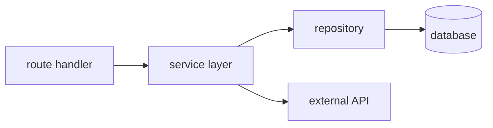
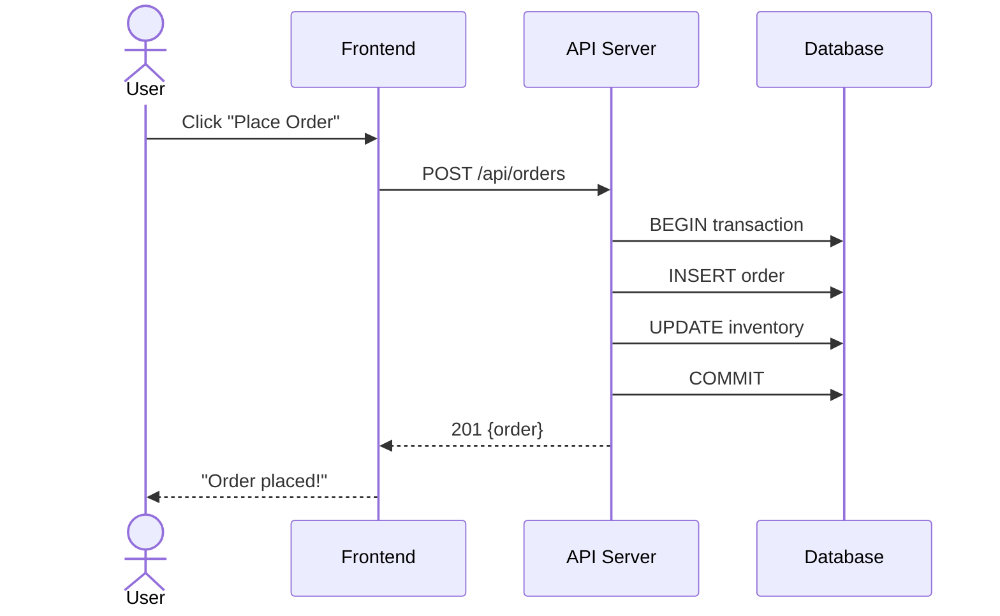
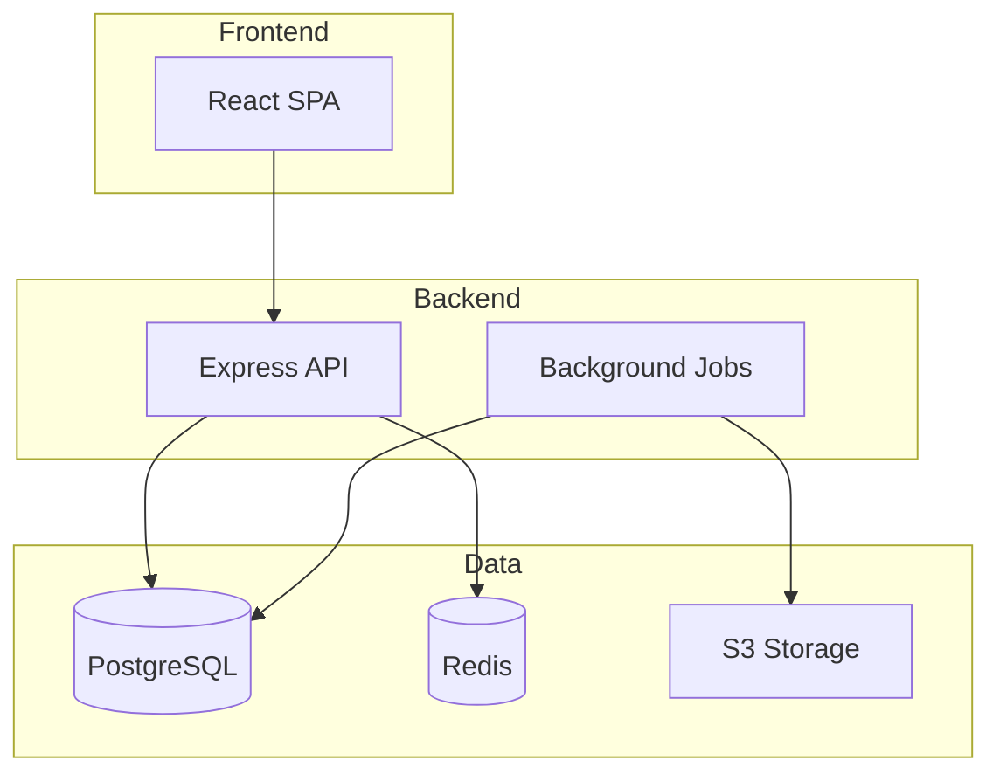

# /sdd-pipeline:learn

Study a part of the codebase and produce a structured explanation. This is **read-only** — no files are created, modified, or generated unless the user asks to save the output.

## When to Use

- "Explain how the auth module works"
- "Walk me through the payment flow"
- "I'm new to this codebase, where do I start?"
- "What does this service do and why is it structured this way?"
- "Learn the API layer for me"

**When NOT to use**: generating documentation (`/sdd-pipeline:docs`), product discovery (`/sdd-pipeline:discover`), or understanding what was just built in this session (`meta/comprehension` handles that automatically after BUILD).

## Input — What to Study

The user points at a target. If no target is specified, study the whole project at overview level.

| User says | Target |
|-----------|--------|
| "learn auth" / "learn the auth module" | Find the auth-related code (grep for auth, login, session, JWT, middleware) |
| "learn src/services/payment/" | That directory and everything it touches |
| "learn the checkout flow" | Trace the flow end-to-end across files |
| "learn this project" / "learn everything" | Project-wide overview — architecture, modules, data model, key flows |
| "learn this function" (with cursor/selection context) | That function + its callers + callees |

## The Process — Read, Trace, Explain

### Step 1: Scope

Determine what to read based on the target:

- **Directory/module**: read all files in it, plus immediate imports/exports to understand boundaries
- **Flow/feature**: trace from entry point (route, handler, UI component) through all layers to data store and back
- **Function**: read the function, its callers (grep for usages), and its callees (follow function calls)
- **Project overview**: read entry points, package manifest, directory structure, key config files, main routes/models

Don't read the entire codebase. Scope to what's relevant + one layer of context around it.

### Step 2: Deep Read

For the scoped area, extract:

1. **Purpose** — what problem does this code solve, for whom
2. **Entry points** — where execution starts (routes, event handlers, exported functions, CLI commands)
3. **Data flow** — how data moves: input → validation → processing → storage → output
4. **Key abstractions** — classes, interfaces, patterns used (and why — is the abstraction earning its keep or is it legacy?)
5. **Dependencies** — what this code depends on (internal modules, external packages) and what depends on it
6. **State management** — where state lives (DB, cache, session, in-memory), how it changes, what triggers changes
7. **Error handling** — what can go wrong, how errors propagate, what's unhandled
8. **Configuration** — env vars, config files, feature flags that affect behavior
9. **Tests** — what's tested, what's not, test patterns used

### Step 3: History (Optional, If Useful)

When the code's current shape is surprising or the user asks "why is it like this":

- `git log --oneline -20 -- [path]` — recent changes, who made them, commit messages
- `git log --diff-filter=A -- [path]` — when files were first added (reveals original intent)
- Look for TODO/FIXME/HACK comments — they're breadcrumbs from past developers

Skip this step for straightforward code. Only dig into history when the code raises questions the code itself doesn't answer.

### Step 4: Explain

Output a structured explanation. The format adapts to the target scope:

#### For a module/directory:

```
## [Module Name]

### What it does
[2-3 sentences. Plain language. What problem it solves and for whom.]

### Architecture
[How the module is structured internally — layers, patterns, key files]



### Key files — start reading here
| File | Role | Why it matters |
|------|------|----------------|
| `handler.ts` | HTTP route handlers | Entry point — read first |
| `service.ts` | Business logic | Core decisions happen here |
| `repository.ts` | Data access | DB queries and mutations |
| `types.ts` | Type definitions | Contracts between layers |

### Data flow
1. Request hits `POST /api/orders` → `handler.createOrder()`
2. Handler validates input (zod schema) → calls `service.createOrder()`
3. Service checks inventory → calculates total → calls `repository.insert()`
4. Repository runs transaction: INSERT order + UPDATE stock
5. Service emits `OrderCreated` event → returns order to handler
6. Handler responds 201 with order JSON

### Dependencies
- **Uses**: `src/lib/db` (connection pool), `src/lib/events` (event bus), `stripe` (payments)
- **Used by**: `src/api/webhooks/` (order status updates), `src/jobs/` (order expiry cron)

### Decisions & trade-offs
- [Why X pattern over Y — only if non-obvious]
- [Known tech debt or gotchas]

### Gaps & risks
- [Missing validation, unhandled errors, missing tests — only real issues, not nitpicks]
```

#### For a flow:

```
## Flow: [Flow Name]

### What happens
[1-2 sentences — the user action and its outcome]

### Step-by-step trace



### Where the code lives
| Step | File | Function | Line |
|------|------|----------|------|
| 1. Route | `src/routes/orders.ts` | `router.post('/')` | 42 |
| 2. Validate | `src/services/order.ts` | `validateOrder()` | 15 |
| 3. Process | `src/services/order.ts` | `createOrder()` | 38 |
| 4. Persist | `src/repositories/order.ts` | `insert()` | 22 |

### Edge cases & error paths
- Cart empty → 400 before DB call
- Item out of stock → 409, transaction rolled back
- Payment fails → order stays in `pending`, retry via webhook
- [Any unhandled cases worth noting]
```

#### For a project overview:

```
## Project: [Name]

### What it is
[2-3 sentences. What the product does, who uses it, what tech stack.]

### Architecture



### Module map
| Directory | What it does | Size | Test coverage |
|-----------|-------------|------|---------------|
| `src/api/` | REST endpoints | 12 files | Good |
| `src/services/` | Business logic | 8 files | Partial |
| `src/models/` | DB models (Prisma) | 6 files | N/A |
| `src/jobs/` | Cron + queue workers | 4 files | None |
| `src/lib/` | Shared utilities | 5 files | Good |

### Data model (key entities)
[Brief ERD or list of main entities + relationships]

### Key flows
1. **User registration** → `src/api/auth/` → `src/services/auth.ts`
2. **Order placement** → `src/api/orders/` → `src/services/order.ts`
3. **Payment webhook** → `src/api/webhooks/` → `src/services/payment.ts`

### Start here
- **New developer**: read `src/api/routes.ts` (route map) → pick a flow → trace it
- **Bug fix**: check `src/services/` (business logic lives here, not in handlers)
- **Add feature**: follow the pattern in `src/api/orders/` (cleanest module)

### Gotchas
- [Things that would surprise a new developer]
```

## Saving to Memory

After explaining, offer to save key findings to `docs/sdd/memory/`:

```
Save to project memory? This would persist:
- Module map + key flows (useful for future sessions)
- Gotchas + tech debt notes (prevents rediscovery)
```

If the user says yes, write a memory note following `skills/meta/memory/SKILL.md`'s format — concise, linked by topic, not a dump of the full explanation. The memory captures the **non-obvious** findings (architecture decisions, gotchas, dependency relationships), not the stuff that's derivable by reading the code again.

## Depth Control

The user controls depth:

- **"learn auth quickly"** / **"quick overview of auth"** → headline-level: purpose + key files + data flow. ~10 lines.
- **"learn auth"** (default) → module-level: full structured explanation. ~30-50 lines.
- **"learn auth deeply"** / **"deep dive into auth"** → trace every branch, read tests, check git history, surface all edge cases. ~80-100 lines.
- **"learn everything"** → project overview first, then ask which area to go deeper on.

## Rules

1. **Read-only.** No files created or modified unless the user explicitly asks to save to memory.
2. **Show the code, don't summarize around it.** When a decision or pattern is interesting, quote the relevant 3-5 lines. "The service uses X" is weaker than "The service uses X — here's the key part: `[snippet]`".
3. **Diagrams earn their place.** Include a Mermaid diagram when the structure or flow has shape worth seeing. Skip it for a single function or a flat module.
4. **Be honest about gaps.** If something is confusing, poorly structured, or looks like a bug — say so. The user is here to understand, not to be reassured.
5. **Don't invent intent.** If the code does something and you don't know why, say "this does X — unclear why" rather than fabricating a rationale. Git history or the user may have the answer.
6. **Adapt to the user.** If memory says the user is senior, skip basics. If they're new to the stack, explain framework conventions alongside the project-specific patterns.

## Mode Behavior

Mode has minimal effect — this is a read-only exploration skill. The only dimension that changes is depth:

| Mode | Behavior |
|------|----------|
| **prototype/vibe** | Quick: purpose + key files + data flow. No history, no edge cases. |
| **standard** | Full structured explanation. History if the code raises questions. |
| **strict** | Deep: trace every branch, read tests, check git history, surface all gaps. |
| **emergency** | Not applicable — studying the codebase is not an emergency activity. |
