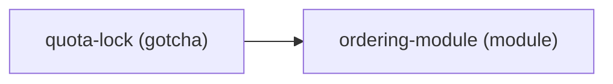

# Project Memory — A Linked Knowledge Graph, Not a Flat List

Re-reading a large codebase from scratch every session is slow and expensive, and re-asking questions the user already answered is a trust failure. This skill fixes both with one structure: a small, Obsidian-style graph of markdown notes capturing what's **durable and non-obvious** about the project, read index-first so the next session (or a cheaper model) gets oriented from a few hundred tokens instead of a full re-scan.

Lives in `docs/sdd/memory/`. Plain markdown + `[[wikilinks]]` — an LLM reads it natively, and the links form a navigable graph.

## Structure

```
docs/sdd/memory/
  INDEX.md            # one line per note — READ THIS FIRST (the map, and cheap)
  <slug>.md           # one note per durable fact
```

Each note: short frontmatter + a focused body linking to related notes:

```markdown
---
description: why concurrent checkouts serialize on the (variant,date) row-lock
type: gotcha        # module | concept | gotcha | how-to | convention | preference | override | pointer
updated: 2026-08-12
---
Reserving quota uses a row-lock (`SELECT … FOR UPDATE`) on the
`(variant, date)` row. The invariant `sold + held ≤ quota` must hold atomically —
see [[ordering-module]]. The lock is why concurrent checkouts serialize here;
don't "optimize" it away. Source: ERD-002 quota table, FSD-007.
```

## The Graph Is Rendered, Not Just Described

"A linked knowledge graph" only earns that name if the links are actually visible as a graph, not just as prose `[[wikilinks]]` scattered across files. `INDEX.md` carries a Mermaid `graph LR` block, above the one-line-per-note list, that's kept current whenever a note is added, removed, or relinked:

````markdown

````

- **One node per note** — id = slug, label = `slug (type)`.
- **One edge per `[[wikilink]]`** found in any note body — `source --> target`, directed from the note containing the link to the note it points at. A link to a note that doesn't exist yet still renders (dangling node, no incoming edges) — it's a visible "worth writing" marker, not silently dropped.
- **Regenerating it is mechanical, not a judgment call**: grep every note body for `[[slug]]` occurrences, rebuild the node/edge list from scratch. Cheap enough to redo on every note change rather than hand-maintain.
- **Cap at ~40 nodes** for readability — past that, keep generating the full edge list (still machine-derived, still correct) but say so in prose above the block ("graph is for orientation; `INDEX.md`'s bullet list below is the authoritative flat index") rather than silently truncating.
- This needs no new tool: Mermaid is already this framework's own diagramming convention (see `docs/ARCHITECTURE.md`), and it renders natively in GitHub, VS Code's built-in Markdown preview, and most other Markdown viewers — a human can open `docs/sdd/memory/INDEX.md` and see the map, and an agent gets the same shape-at-a-glance benefit before deciding which notes are worth opening in full.

## What Belongs Here (Two Jobs, One Graph)

**Codebase knowledge** (so the agent doesn't full-scan):
- What each module does + where it lives + its public interface
- Domain concepts and their real meaning; **gotchas** (non-obvious traps, "why it's like this")
- Recurring how-tos; pointers to where important things live in the code

**Answered questions** (so the user is never re-asked):
- Conventions ("CRUD endpoints here use Zod validation, JWT auth, cursor pagination")
- Preferences ("Tailwind over CSS modules — the team knows Tailwind")
- Constraint overrides ("'no factory' overridden in the product module: 12 product types") — always dated, with the reason

**Not here**: the spec (that's `docs/sdd/`), anything obvious from a quick read, git history, a blow-by-blow of changes. Memory earns its keep by holding what you'd otherwise have to *rediscover or re-ask*.

## Rules (Keep It Cheap)

- **One durable fact per note**, short. A note growing into several topics gets split — small notes link better and load cheaper.
- **Link liberally** with `[[slug]]` — a link to a note that doesn't exist yet is fine; it marks something worth writing later. The links ARE the graph.
- **`INDEX.md` is the map**: one line per note — `- [[slug]] — <the note's description>` — always current. Read it first, match the task to a note by its hook, **open only those few notes**. Never load the whole vault; that defeats the point.
- **Update a note when it's wrong; delete when obsolete.** Stale memory is worse than none.
- **Seed on brownfield, grow as you go.** The first context-loading pass on an existing repo seeds it; every session that learns something durable adds or fixes a note.
- Only save what's likely to be **repeated**. One-off choices don't need memory.
- `check-file-hygiene.mjs` verifies the structure mechanically (note naming, frontmatter, every note indexed).

## How It's Used

1. **Session start / task start**: read `INDEX.md`, open the notes relevant to the area being touched. That plus a targeted code read replaces a full re-scan. The project's `CLAUDE.md`/`AGENTS.md` should point here so it happens every session.
2. **Before elicitation**: check for previously answered questions — if memory has the answer, use it silently, don't re-ask.
3. **Before constraint checks**: check for saved overrides — don't re-flag an overridden constraint in the same context.
4. **Escape hatch**: user says "this is different / not this time" → skip the note for THIS task only; don't delete it.

## Mode Behavior

| Mode | Behavior |
|------|----------|
| prototype | Don't save (prototype decisions aren't meant to last) |
| vibe / standard | Save automatically |
| strict | Save with detailed context |
| emergency | Don't save during the fix; capture durable learnings in the post-fix follow-up |

## Exit

`INDEX.md` reflects every note and its Mermaid graph block reflects the current link structure; each note is one focused, linked fact; the next session can get oriented from memory + a targeted read instead of a full re-scan. What this session learned that's durable is written down, not lost.
