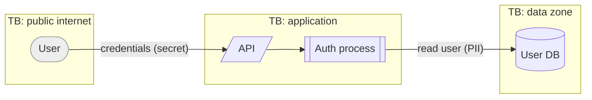

# to-diagrams — visual models as code

Pictures are not decoration here. The **data-flow diagram** is the input to the
security gate (`threat-model`): every arrow crossing a trust boundary becomes a
threat to reason about. The **sequence diagrams** become the backbone of e2e
test cases. So draw for rigor, not for looks.

All diagrams are **Mermaid**, embedded in `docs/sdd/02-diagrams.md`, so they
version-control and render in most agents/hosts without external tools.

## Which diagrams, and when

Pick what the feature needs — don't produce all five reflexively:

1. **Context diagram** (always) — the system as one box, plus every external
   actor and system it talks to. Frames scope.
2. **Data-flow diagram / DFD** (whenever data moves between components or trust
   zones) — processes, data stores, external entities, and **trust boundaries**.
   Label each flow with what data it carries. This is mandatory before the
   threat model if any sensitive data (PII, credentials, payments) is involved.
3. **Sequence diagram** (per key user journey / REQ) — the ordered messages
   between actors and components for one scenario. One per happy path; add
   alternates for important failure paths.
4. **ERD** (if there's persistent data) — entities, keys, relationships.
5. **State diagram** (if an entity has a lifecycle) — e.g. order:
   draft→placed→paid→shipped.

## How to draw them

Reference `templates/` for starter Mermaid. Conventions:

- **Trust boundaries** in the DFD: draw with `subgraph` blocks named
  `TB: <zone>` (e.g. `TB: public internet`, `TB: internal network`,
  `TB: PCI zone`). The threat model keys off these names.
- **Tag flows with data + sensitivity**: `-->|"login creds (secret)"|`.
- **Link back to REQs**: put a comment `%% covers REQ-003, REQ-007` above each
  diagram so `traceability` can connect them.
- Keep each diagram to one idea. Five small diagrams beat one unreadable one.

### DFD skeleton (Mermaid)

## Exit gate

Context diagram exists; a DFD with labeled trust boundaries exists for every
flow touching sensitive data; a sequence diagram exists for each Must-priority
REQ journey. Then invoke `traceability`, and the DFD is ready for `threat-model`.
