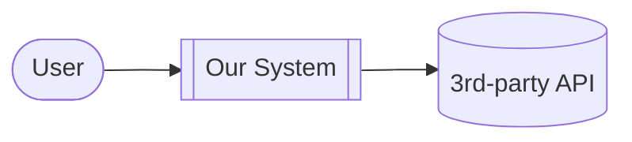
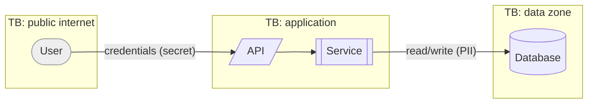
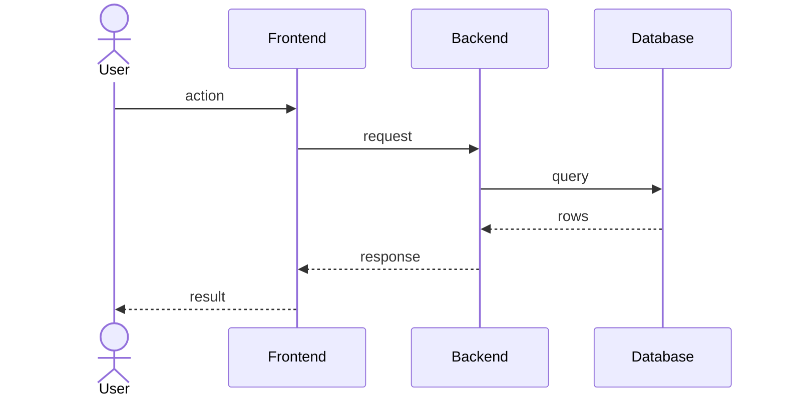
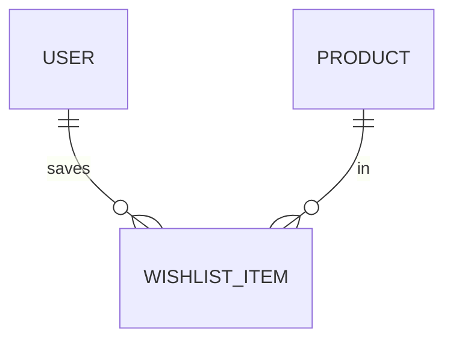
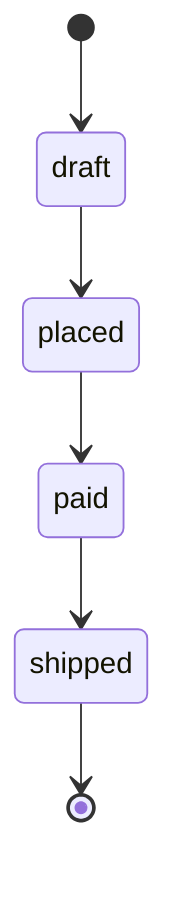

# Diagrams — <system name>

> **Plain-language summary:** _what these pictures show, in a sentence or two._

All diagrams are Mermaid so they version-control and render inline. Add
`%% covers REQ-xxx` above each so traceability can link them.

## 1. Context diagram

## 2. Data-flow diagram (DFD) with trust boundaries

## 3. Sequence diagram — <journey name>

## 4. ERD (if persistent data)

## 5. State diagram (if an entity has a lifecycle)

